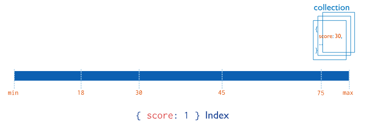
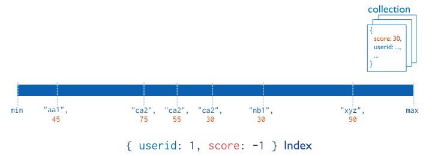
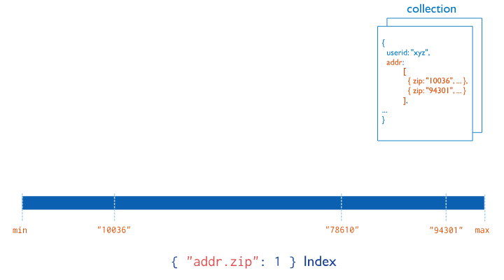

# MongoDb
document-oriented database that stores data as BSON (binary JSON) documents

Documents
- Self-contained records made of field–value pairs.
- Can contain nested documents and arrays.
- Map naturally to objects in most programming languages.

Collections
- Groups of documents (similar to tables, but without rigid schemas).
- Support flexible or enforced schemas depending on your needs.

BSON Format
- Binary-encoded JSON that supports more data types and faster processing.

https://www.knowi.com/blog/mongodb-vs-sql/

https://www.mongodb.com/resources/basics/databases/nosql-explained/nosql-vs-sql
## Paradigm 
### SQL
- relational databases
- designed to store data that has a structured schema

### MongoDB
- support this different type of data that was unstructured and not suitable for schemas

## How Data is stored
### SQL
- data is stored in tables 
- column denotes the attribute and row represents a particular record
- relational property where different tables are related to each other with foreign keys, primary keys.

### MongoDB
- data is stored in collections(~SQL tables)
- a collection can consist of many documents in which data is stored in JSON format of key-value. 
- cannot establish relationship between the unstructured data

## Scalability
### SQL
- Traditionally scales vertically (increasing memory size, disk space or computing power).
- Some modern SQL systems support horizontal scaling, but not as natively.

### MongoDB
- Built for horizontal scaling (sharding).
- Easily handles massive datasets and distributed workloads.

## Reliability and Availability
### SQL
- architecture moved towards a distributed database, where the database runs on a cluster of nodes, thus increasing resilience
- Long-standing ACID compliance.
- Strong consistency and integrity guarantees.

### MongoDB
- originally designed keeping resilience in mind
- Supports ACID transactions across multiple documents.
- Replication built‑in for high availability.

## Schema
### SQL
- predefined schema to which the data should comply

### MongoDB
- no need to predefine any schema
- collection can store different types of documents

## Querying and Analytics
### SQL
- Uses SQL (Structured Query Language).
- Excels at complex joins, window functions, and analytical queries.
- Ideal for systems requiring strict consistency and relational logic.

### MongoDB
- Uses a rich document query API.
- Supports nested queries, arrays, geospatial search, aggregation pipelines.
- Great for real‑time analytics and dynamic data exploration.

| | MongoDB | MySQL |
|- |---------|--------|
| Paradigm | NoSQL, supports unstructured data | SQL, supports structured data with schemas |
| Data Storage | Collections containing JSON documents | Tables with rows and columns |
| Relationships | No support for table relationships | Supports relationships with foreign keys and primary keys |
| Data Model | Non-relational | Relational |
| Scalability | Supports horizontal scaling (sharding) | Supports vertical scaling |
| Reliability and Availability | Built for resilience and availability | Architecture moved towards distributed databases for reliability |
| Schema | No predefined schema, dynamic structure | Predefined schema required for data structure |
| Query Language | Limited document querying, no support for joins | Uses SQL for querying and advanced analytics functions |

SQL-ből könnyen lehet MongoDB-re migrálni

## Forrás és hasznos
https://www.humongous.io/tools/playground/mongodb/new <br>
https://www.mongodb.com/docs/manual/reference/method/db.collection.drop/ <br>
https://www.mongodb.com/docs/manual/tutorial/query-documents/ <br>
https://github.com/neelabalan/mongodb-sample-dataset?tab=readme-ov-file
```json
[
  {
    item: "journal",
    qty: 25,
    size: {
      h: 14,
      w: 21,
      uom: "cm"
    },
    status: "A"
  },
  {
    item: "notebook",
    qty: 50,
    size: {
      h: 8.5,
      w: 11,
      uom: "in"
    },
    status: "A"
  },
  {
    item: "paper",
    qty: 100,
    size: {
      h: 8.5,
      w: 11,
      uom: "in"
    },
    status: "D"
  },
  {
    item: "planner",
    qty: 75,
    size: {
      h: 22.85,
      w: 30,
      uom: "cm"
    },
    status: "D"
  },
  {
    item: "postcard",
    qty: 45,
    size: {
      h: 10,
      w: 15.25,
      uom: "cm"
    },
    status: "A"
  }
]
```
## Lekérdezés
https://www.mongodb.com/docs/manual/reference/method/db.collection.find/

Returns: A cursor to the documents that match the query criteria. When the find() method "returns documents," the method is actually returning a cursor to the documents.

MongoDB:
```js
db.collection.find( <query>, <projection>, <options> )

db.collection.find()

db.collection.find({
  status: "A"
})
```
Node.js-ben:
```js
const cursor = db.collection('inventory').find({});

const cursor = db.collection('inventory').find({ status: 'A' });
```

### Comparison Query Predicate Operators
Operator|Description
|-|-|
$eq|Matches values equal to a specified value.
$gt|Matches values greater than a specified value.
$gte|Matches values greater than or equal to a specified value.
$in|Matches any values specified in an array.
$lt|Matches values less than a specified value.
$lte|Matches values less than or equal to a specified value.
$ne|Matches all values not equal to a specified value.
$nin|Matches if the value is not equal to any of a given list of values.

#### Array Query Predicate Operators
Name|Description
|-|-|
$all|Matches arrays that contain all elements specified in the query.
$elemMatch|Selects documents if at least one element in the array field matches all the specified $elemMatch conditions.
$size|Selects documents if the array field contains the specified number of elements.

## Beszúrás
**NB!**
- **collection ~ SQL table**
- **document ~ SQL record**

https://www.mongodb.com/docs/manual/tutorial/insert-documents/

Metódus|	Dokumentumok száma|
|-|-|
insert()|	1 vagy több, **Deprecated!**|
insertOne()|	1	|
insertMany()|	több|

### Insert a Single Document: 
Returns a document containing:
- A boolean acknowledged as true if the operation ran with write concern or false if write concern was disabled.
- A field insertedId with the _id value of the inserted document.

MongoDB:
```js
db.collection.insertOne(
    <document>,
    {
      writeConcern: <document>
    }
)

db.collection.insertOne({
  item: 'canvas',
  qty: 100,
  tags: ['cotton'],
  size: { h: 28, w: 35.5, uom: 'cm' }
});
```
Node.js-ben:
```js
await db.collection('inventory').insertOne({
  item: 'canvas',
  qty: 100,
  tags: ['cotton'],
  size: { h: 28, w: 35.5, uom: 'cm' }
});
```

### Insert Multiple Documents
Returns a document containing:
- An acknowledged boolean, set to true if the operation ran with write concern or false if write concern was disabled
- An insertedIds array, containing _id values for each successfully inserted document

MongoDB:
```js
db.collection.insertMany(
   [ <document 1> , <document 2>, ... ],
   {
      writeConcern: <document>,
      ordered: <boolean>
   }
)

db.collection.insertMany([
  {
    item: 'journal',
    qty: 25,
    tags: ['blank', 'red'],
    size: { h: 14, w: 21, uom: 'cm' }
  },
  {
    item: 'mat',
    qty: 85,
    tags: ['gray'],
    size: { h: 27.9, w: 35.5, uom: 'cm' }
  },
  {
    item: 'mousepad',
    qty: 25,
    tags: ['gel', 'blue'],
    size: { h: 19, w: 22.85, uom: 'cm' }
  }
]);
```

Node.js-ben:
```sql
await db.collection('inventory').insertMany([
  {
    item: 'journal',
    qty: 25,
    tags: ['blank', 'red'],
    size: { h: 14, w: 21, uom: 'cm' }
  },
  {
    item: 'mat',
    qty: 85,
    tags: ['gray'],
    size: { h: 27.9, w: 35.5, uom: 'cm' }
  },
  {
    item: 'mousepad',
    qty: 25,
    tags: ['gel', 'blue'],
    size: { h: 19, w: 22.85, uom: 'cm' }
  }
]);
```

## Frissítés
### Update a Single Document
Returns a document that contains:
- matchedCount containing the number of matched documents
- modifiedCount containing the number of modified documents
- upsertedId containing the _id for the upserted document
- upsertedCount containing the number of upserted documents
- A boolean acknowledged as true if the operation ran with write concern or false if write concern was disabled

MongoDB:
```js
db.collection.updateOne(
   <filter>,
   <update>,
   {
     upsert: <boolean>,
     writeConcern: <document>,
     collation: <document>,
     arrayFilters: [ <filterdocument1>, ... ],
     hint:  <document|string>,
     let: <document>,
     sort: <document>,
     maxTimeMS: <int>,
     bypassDocumentValidation: <boolean>
   }
)

db.collection.updateOne(
  { item: 'paper' },
  {
    $set: { 'size.uom': 'cm', status: 'P' },
    $currentDate: { lastModified: true }
  }
);
```
Node.js-ben:
```js
await db.collection('inventory').updateOne(
  { item: 'paper' },
  {
    $set: { 'size.uom': 'cm', status: 'P' },
    $currentDate: { lastModified: true }
  }
);
```
Ha több is van, amire a filter megfelelő:
- az első dokumentum, amelyet a MongoDB a belső tárolási sorrendben megtalál
- ha van index a filter mezőn, akkor az index szerinti első találat
- ha nincs index, akkor a fizikai tárolási sorrend szerinti első találat


### Update Multiple Documents
Returns a document that contains:
- A boolean acknowledged as true if the operation ran with write concern or false if write concern was disabled
- matchedCount containing the number of matched documents
- modifiedCount containing the number of modified documents
- upsertedId containing the _id for the upserted document
- upsertedCount containing the number of upserted documents

MongoDB:
```js
db.collection.updateMany(
   <filter>,
   <update>,
   {
     upsert: <boolean>,
     writeConcern: <document>,
     collation: <document>,
     arrayFilters: [ <filterdocument1>, ... ],
     hint:  <document|string>,
     let: <document>,
     maxTimeMS: <int>,
     bypassDocumentValidation: <boolean>
   }
)

db.collection.updateMany(
  { qty: { $lt: 50 } },
  {
    $set: { 'size.uom': 'in', status: 'P' },
    $currentDate: { lastModified: true }
  }
);
```
Node.js-ben:
```js
await db.collection('inventory').updateMany(
  { qty: { $lt: 50 } },
  {
    $set: { 'size.uom': 'in', status: 'P' },
    $currentDate: { lastModified: true }
  }
);
```

## Törlés
### Delete Only One Document that Matches a Condition
Returns a document containing:
- A boolean acknowledged as true if the operation ran with write concern or false if write concern was disabled
- deletedCount containing the number of deleted documents

MongoDB:
```js
db.collection.deleteOne(
    <filter>,
    {
      writeConcern: <document>,
      collation: <document>,
      hint: <document|string>,
      maxTimeMS: <int>,
      let: <document>
    }
)

db.collection.deleteOne({ status: 'D' });
```
Node.js-ben:
```js
await db.collection('inventory').deleteOne({ status: 'D' });
```

### Delete All Documents that Match a Condition
Returns a document containing:
- A boolean acknowledged as true if the operation ran with write concern or false if write concern was disabled
- deletedCount containing the number of deleted documents

MongoDB:
```js
db.collection.deleteMany(
   <filter>,
   {
      writeConcern: <document>,
      collation: <document>,
      hint: <document>|<string>,
      maxTimeMS: <int>,
      let: <document>
   }
)

db.collection.deleteMany({ status: 'A' });
```
Node.js-ben:
```js
await db.collection('inventory').deleteMany({ status: 'A' });
```

### Delete All Documents
To delete all documents from a collection, pass an empty filter document {} to the Collection.deleteMany() method.
MongoBD:
```js
db.collection.deleteMany({});
```
Node.js-ben:
```js
await db.collection('inventory').deleteMany({});
```

## Drop
Removes a collection or view from the database. The method also removes any indexes associated with the dropped collection. The method provides a wrapper around the drop command.
```js
db.collection.drop( { writeConcern: <document> } )

db.collection.drop( {} )
```

## Text Search
```json
   [
     { _id: 1, name: "Java Hut", description: "Coffee and cakes" },
     { _id: 2, name: "Burger Buns", description: "Gourmet hamburgers" },
     { _id: 3, name: "Coffee Shop", description: "Just coffee" },
     { _id: 4, name: "Clothes Clothes Clothes", description: "Discount clothing" },
     { _id: 5, name: "Java Shopping", description: "Indonesian goods" },
     { _id: 6, name: "NYC_Coffee Shop", description: "local NYC coffee" }
   ]
```
```js
db.stores.createIndex( { name: "text", description: "text" } )

db.stores.find( { $text: { $search: "\"coffee shop\"" } } )
```
```json
[
   { _id: 3, name: 'Coffee Shop', description: 'Just coffee' },
   { _id: 6, name: 'NYC_Coffee Shop', description: 'local NYC coffee' }
]
```
Unless specified, exact string search is not case sensitive or diacritic sensitive. For example, the following query returns the same results as the previous query:
```js
db.stores.find( { $text: { $search: "\"COFFEé SHOP\"" } } )
```

## Transactions
Advantages of Transactions in MongoDB:
- MongoDB transactions provide ACID guarantees that ensure data validity and reliability despite failures and concurrent operations.

Disadvantages of MongoDB Transactions
1. Performance Overhead: Transactions introduce performance overhead, especially in **write-intensive workloads**. The need for coordination between operations and locking mechanisms can slow down the overall performance of the database.
2. Complexity in Implementation: Implementing transactions, especially for multi-document transactions, requires additional code and logic. For complex systems with many operations across different collections, managing these transactions can become difficult.
3. Not Ideal for All Use Cases: MongoDB transactions are not necessary for every application. For example, if your application performs only simple operations where atomicity is not a critical concern, transactions may add unnecessary overhead.

Sorrend (Node.js-ben): 
1. Session indítása
    - ```js
        const session = client.startSession();
        ```
2. Tranzakció indítása
    - ```js
        session.startTransaction();
        ```
3. Műveletek végrehajtása
    - ```js
        await users.updateOne({ _id: 1 }, { $set: { balance: 100 } }, { session });
        await logs.insertOne({ msg: "Balance updated" }, { session });
        ```
4. Commit vagy abort
    - ```js
        await session.commitTransaction();
        // vagy
        await session.abortTransaction();
        ```

Érdemes használni:
- Több dokumentumot kell konzisztensen módosítani (pl. pénz átvezetése két számla között)
- Több collectiont érintő műveletek
- Olyan logika, ahol nem megengedhető, hogy csak a műveletek egy része fusson le

Nem érdemes használni:
- Nagy mennyiségű dokumentum módosítása
- Nagy forgalmú rendszerek, ahol a tranzakciók lassítanák a throughputot
- Egyszerű CRUD műveletek, ahol nincs szükség ACID garanciára

Tranzakciók korlátai
- Csak replica set vagy sharded cluster esetén működnek
- Maximum 60 másodperc lehet egy tranzakció
- Nagy dokumentumok vagy sok írás lassíthatja a rendszert
- A tranzakciók memóriában futnak, ezért drágábbak, mint a sima műveletek

replica set: a **group of mongod instances** that maintain the same data set, providing redundancy, high availability, and data disaster recovery. It consists of **one primary node** that receives all writes and **multiple secondary nodes** that replicate data<br>
sharded cluster: a MongoDB deployment designed to handle high-throughput operations and large datasets by horizontally partitioning data across multiple servers (shards). It consists of **shards (replica sets holding data), config servers (storing metadata), and mongos routers (directing client queries to the correct shard)**.

## Firebase VS. MongoDB
1. Firebase : 
- stores and synchronizes data in real-time
- Cloud-hosted real-time document store
- gives the flexibility to access data from any device iOS, Android
- JavaScript clients share one Realtime Database instance and automatically receive updates with the newest data 

2. MongoDB : 
- cross-platform document-oriented and nonrelational (NoSQL) database 
- high performance and is dynamic in nature where we do not need to predefine a schema
- open-source document database, stores the data in the form of key-value pairs
- written in C++, Go, JavaScript, Python languages.
- high speed, high availability, and high scalability. 

|FIREBASE|	MONGODB|
|-|-|
|It support Objective C, Java and JavaScript as programming languages.|It supports C, C#, Java, JavaScript, PHP, Lua, Python, R, Ruby as programming languages.
|It is a commercial database.|It is an open-source database.
|It does not support any replication methods.|	The replication method that MongoDB supports is Master-Slave Replication.
|It does not support Map Reduce methods.|It supports Map Reduce methods.
|It does not support any partitioning method.|It supports Sharding Partitioning method.
|Android, iOS, JavaScript API, RESTful HTTP API are used as APIs and other access methods.|Proprietary protocol using JSON are used as APIs and other access methods.
|It is more suitable for small-scale applications.|	It is more suitable for large-scale applications.
|	It is not much secure.|	It provides more security than Firebase.

## Connection
mongosh (MongoDB Shell) is the modern, official command-line interface (CLI) for interacting with MongoDB deployments
https://www.mongodb.com/docs/mongodb-shell/connect/
MongoDBCompass-szal egyszerű, de egyébként terminálban:
```
mongosh

ugyan az, mint a 
mongosh "mongodb://localhost:27017
```
Ehhez viszont telepítve kell lennie a MongoDb Shell-nek.

## Collection létrehozás (amikor  belenúlsz létrehoz e magától)
Igen, létrehoz megától, de lehet manuálisan is.
```js
db.createCollection( <name>,
    {
      capped: <boolean>,
      timeseries: {                  // Added in MongoDB 5.0
         timeField: <string>,        // required for time series collections
         metaField: <string>,
         granularity: <string>,
         bucketMaxSpanSeconds: <number>,  // Added in MongoDB 6.3
         bucketRoundingSeconds: <number>  // Added in MongoDB 6.3
      },
      expireAfterSeconds: <number>,
      clusteredIndex: <document>,  // Added in MongoDB 5.3
      changeStreamPreAndPostImages: <document>,  // Added in MongoDB 6.0
      size: <number>,
      max: <number>,
      storageEngine: <document>,
      validator: <document>,
      validationLevel: <string>,
      validationAction: <string>,
      indexOptionDefaults: <document>,
      viewOn: <string>,
      pipeline: <pipeline>,
      collation: <document>,
      writeConcern: <document>,
      encryptedFields: <document>
    }
  )
```

## Vagy operátor
```js
const cursor = db.collection('inventory').find({
  $or: [{ status: 'A' }, { qty: { $lt: 30 } }]
});

const cursor = db.collection('inventory').find({
  status: 'A',
  $or: [{ qty: { $lt: 30 } }, { item: { $regex: '^p' } }]
});
```

```sql
SELECT * FROM inventory WHERE status = "A" OR qty < 30

SELECT * FROM inventory WHERE status = "A" AND ( qty < 30 OR item LIKE "p%")
```

$and, $nor, $or, $not
https://www.mongodb.com/docs/manual/reference/mql/query-predicates/logical/


## Drop és delete közti különbség, ténylgesen törli-e a tárról

### drop()
- Minden dokumentum törlődik
- Az indexek is törlődnek
- A collection megszűnik létezni
- A tárhelyet a MongoDB felszabadítja (vagyis ténylegesen törlődik a fájlrendszerről)

### deleteOne() / deleteMany()
- A dokumentumok törlődnek
- Az indexek megmaradnak
- A collection továbbra is létezik
- A tárhelyet nem feltétlenül szabadítja fel azonnal (MongoDB WiredTiger storage engine "lazy" módon kezeli a helyet)

## Aggregation Operations
Aggregation operations process multiple documents and return computed results. You can use aggregation operations to:
- Group values from multiple documents together.
- Perform operations on the grouped data to return a single result.
- Analyze data changes over time.
- Query the most up-to-date version of your data.
```js
db.collection.aggregate( <pipeline>, <options> )
```
Returns:	
- A cursor for the documents produced by the final stage of the aggregation pipeline.
- If the pipeline includes the explain option, the query returns a document that provides details on the processing of the aggregation operation.
- If the pipeline includes the $out or $merge operators, the query returns an empty cursor.

In this pipeline, we'll find the top three airlines that offer the most direct flights out of the airport in Portland, Oregon, USA (PDX).
```js
db.routes.aggregate( [
   {
      $match : {
         "src_airport" : "PDX",
         "stops" : 0
      }
   },
   {
      $group : {
         _id : {
            "airline name": "$airline.name",
         },
         count : {
            $sum: 1
         }
      }
   },
   {
      $sort : {
         count : -1
      }
   },
   {
      $limit : 3
   }
] )
```
1. add a $match stage to filter the documents to flights that have a src_airport value of PDX and zero stops
2. $group the documents by airline name and count the number of flights
3. find the airlines with the most flights, use the $sort stage to sort the remaining documents in descending order
4. use the $limit stage to return the top three airlines that offer the most direct flights out of PDX

## Indexes
Indexes support efficient execution of queries in MongoDB. Without indexes, MongoDB must scan every document in a collection to return query results. If an appropriate index exists for a query, MongoDB uses the index to limit the number of documents it must scan.

### Create
```js
db.<collection>.createIndex(
   { <field>: <value> },
   { name: "<indexName>" }
)

const result = db.collection.createIndex({ name: 1 });
print(result);

db.<collection>.getIndexes()

db.collection.getIndexes()
```

### Drop 
```js
// Drop a Single Index
db.<collection>.dropIndex("<indexName>")

// Drop Multiple Indexes
db.<collection>.dropIndexes( [ "<index1>", "<index2>", "<index3>" ] )

// Drop All Indexes Except the _id Index
db.<collection>.getIndexes()
```
Returns:
- After you drop an index, the system returns information about the status of the operation.

### Types
**Single Field Indexes**
-  Stores information from a single field in a collection. By default, all collections have an index on the _id field. You can add additional indexes to speed up important queries and operations.
- When you create an index, specify the field and the sort order (1 for ascending, -1 for descending).
- ```js
    db.<collection>.createIndex( { <field>: <sort-order> } )
    ```
- 
    - This image shows an ascending index on a single field, score
    - In this example, each document in the collection that has a value for the score field is added to the index in ascending order.
- Use Cases:
    - If your application repeatedly runs queries on the same field, you can create an index on that field to improve performance.

**Compound Indexes**
- Compound indexes collect and sort data from multiple field values from each document in a collection. You can use the compound index to query the first field or any prefix fields of the index. The order of fields in a compound index is very important. The B-tree created by a compound index stores the sorted data in the order that the index specifies the fields.
- ```js
    db.<collection>.createIndex( {
    <field1>: <sortOrder>,
    <field2>: <sortOrder>,
    ...
    <fieldN>: <sortOrder>
    } )
    ```
- 
    - documents are first sorted by userid in ascending order (alphabetically)
    - then, the scores for each userid are sorted in descending order
- Use Cases
    - If your application repeatedly runs a query that contains multiple fields, you can create a compound index to improve performance for that query. 

**Multikey Indexes**
- Collect and sort data from fields containing array values
- When you create an index on a field that contains an array value, MongoDB automatically sets that index to be a multikey index.
- ```js
    db.<collection>.createIndex( { <arrayField>: <sortOrder> } )
    ```
- 
    - This image shows a multikey index on the addr.zip field:
- Use Cases
    - If your application frequently queries a field that contains an array value, a multikey index improves performance for those queries.

**Wildcard Indexes**
- MongoDB supports creating indexes on a field, or set of fields, to improve performance for queries. MongoDB supports flexible schemas, meaning document field names may differ within a collection. Use wildcard indexes to support queries against arbitrary or unknown fields.
- ```js
    db.collection.createIndex( { "$**": <sortOrder> } )
    ```
- Use Cases
    - Only use wildcard indexes when the fields you want to index are unknown or may change. Wildcard indexes don't perform as well as targeted indexes on specific fields. If your collection contains arbitrary field names that prevent targeted indexes, consider remodeling your schema to have consistent field names. To learn more about targeted indexes, see Create Indexes to Support Your Queries.
    - Consider using a wildcard index in the following scenarios:
        - If your application queries a collection where field names vary between documents, create a wildcard index to support queries on all possible document field names.
        - If your application repeatedly queries an embedded document field where the subfields are not consistent, create a wildcard index to support queries on all of the subfields.
        - If your application queries documents that share common characteristics. A compound wildcard index can efficiently cover many queries for documents that have common fields. To learn more, see Compound Wildcard Indexes.

**Geospatial Indexes**
- Geospatial indexes support queries on data stored as GeoJSON objects or legacy coordinate pairs. You can use geospatial indexes to improve performance for queries on geospatial data or to run certain geospatial queries.
- MongoDB provides two types of geospatial indexes:
    - 2dsphere Indexes, which support queries that interpret geometry on a sphere.
    - 2d Indexes, which support queries that interpret geometry on a flat surface.
- Use Cases
    - If your application frequently queries a field that contains geospatial data, you can create a geospatial index to improve performance for those queries.
    - Certain query operations require a geospatial index. If you want to query with the $near or $nearSphere operators or the $geoNear aggregation stage, you must create a geospatial index.

**Hashed Indexes**
- Hashed indexes collect and store hashes of the values of the indexed field.
- Hashed indexes support sharding using hashed shard keys. Hashed based sharding uses a hashed index of a field as the shard key to partition data across your sharded cluster.
- Use Cases
    - Hashed indexing is ideal for shard keys with fields that change monotonically like ObjectId values or timestamps. When you use ranged sharding with a monotonically increasing shard key value, the chunk with an upper bound of MaxKey receives the majority incoming writes. This behavior restricts insert operations to a single shard, which removes the advantage of distributed writes in a sharded cluster.

## Data Types
Date
- mongosh provides various methods to return the date, either as a string or as a Date object:
    - Date() method which returns the current date as a string.
    - new Date() constructor which returns a Date object using the ISODate() wrapper.
    - ISODate() constructor which returns a Date object using the ISODate() wrapper.

ObjectId
- mongosh provides the ObjectId() wrapper class around the ObjectId data type. To generate a new ObjectId, use the following operation in mongosh:
- ```js
    new ObjectId
    ```

Double
- The Double() constructor can be used to explicitly specify a double:
- ```js
    db.types.insertOne(
        {
            "_id": 2,
            "value": Double(1),
            "expectedType": "Double"
        }
    )
    ```

Int32
- The Int32() constructor can be used to explicitly specify 32-bit integers.
- ```js
    db.types.insertOne(
        {
            "_id": 1,
            "value": Int32(1),
            "expectedType": "Int32"
        }
    )
    ```

Long
- The Long() constructor can be used to explicitly specify a 64-bit integer.
- ```js
    db.types.insertOne(
        {
            "_id": 3,
            "value": Long(1),
            "expectedType": "Long"
        }
    )
    ```

Decimal128
- Decimal128() values are 128-bit decimal-based floating-point numbers that emulate decimal rounding with exact precision.
- This functionality is intended for applications that handle monetary data, such as financial, tax, and scientific computations.
- The Decimal128 BSON type uses the IEEE 754 decimal128 floating-point numbering format which supports 34 decimal digits (i.e. significant digits) and an exponent range of −6143 to +6144.
- ```js
    db.types.insertOne(
        {
            "_id": 5,
            "value": Decimal128("1"),
            "expectedType": "Decimal128"
        }
    )
    ```

Timestamp
- MongoDB uses a BSON Timestamp internally in the oplog. The Timestamp type works similarly to the Java Timestamp type. Use the Date type for operations involving dates.
- A Timestamp signature has two optional parameters.
- ```js
    Timestamp( { "t": <integer>, "i": <integer> } )
    ```
Parameter|Type|Default|Definition
|-|-|-|-|
t|integer|Current time since UNIX epoch.|Optional. A time in seconds.
i|integer|1|Optional. Used for ordering when there are multiple operations within a given second. i has no effect if used without t.

Type Checking
- Use the $type query operator or examine the object constructor to determine types.


## Példák
```js
db.routes.aggregate( [
  {
    $sort : {
    	stops : -1
    }
  },
  {
    $limit : 5
  }
] )
```
- 5 legtöbb megállóval rendelkező dokumentum (járat)
```js
db.routes.aggregate( [
  {
    $group : {
      _id : {
        "airline name": "$airline.name",
      },
      count : {
  			$sum : 1
      }
    }
  },
  {
    $sort : {
      count: -1
    }
  },
  {
    $limit : 5
  }
] )
```
- 5 legtöbbször szereplő légitársaság