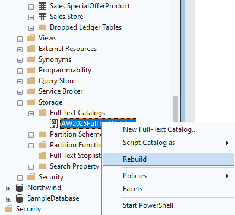
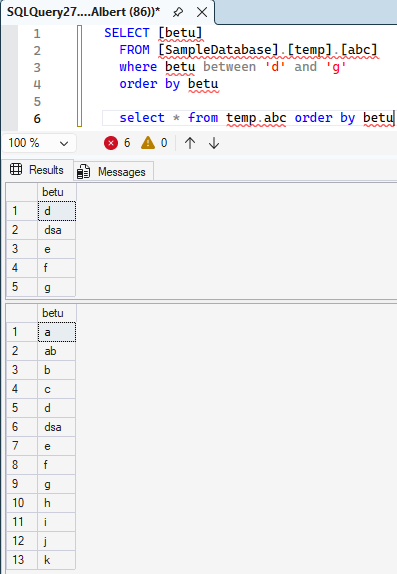
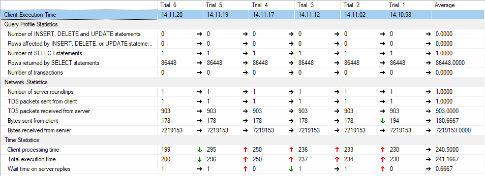
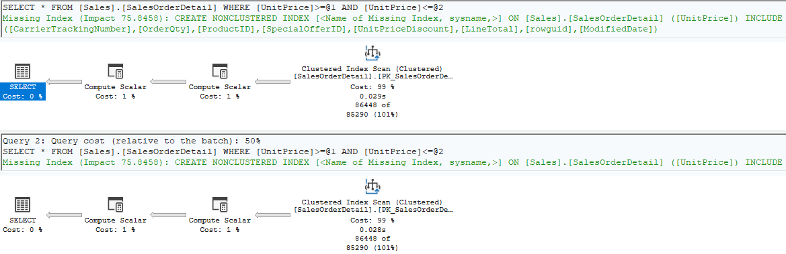
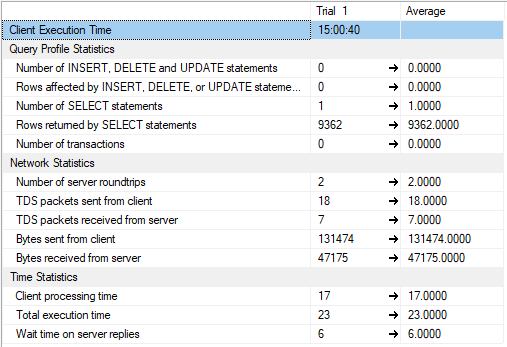
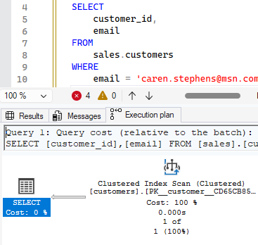
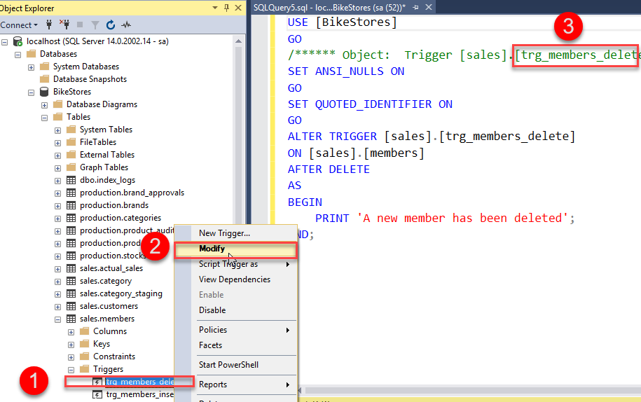

# Plusz infók

## _'szoveg'_ és _like szoveg_ közti különbség 
- LIKE does wildcard matching.
- LIKE also has an ESCAPE clause so you can set an escape character.
- ```sql
    use AdventureWorks2025

    select FirstName as '=' from Person.Person where FirstName = 'G%'
    go
    select FirstName as 'like' from Person.Person where FirstName like 'G%'
    ```
    - 
- ```sql
    use AdventureWorks2025

    select FirstName as '=' from Person.Person where FirstName = 'Gabriel'
    go
    select FirstName as 'like' from Person.Person where FirstName like 'Gabriel'
    ```
- A LIKE lassabb
- 
- https://stackoverflow.com/questions/6142235/sql-like-vs-performance/28609481#28609481
- ```sql
    -- Source - https://stackoverflow.com/a/6143002
    -- Posted by JNK, modified by community. See post 'Timeline' for change history
    -- Retrieved 2026-03-02, License - CC BY-SA 3.0

    Create Table #TempTester (id int, col1 varchar(20), value varchar(20))
    go

    INSERT INTO #TempTester (id, col1, value)
    VALUES
    (1, 'this is #1', 'abcdefghij')
    GO

    INSERT INTO #TempTester (id, col1, value)
    VALUES
    (2, 'this is #2', 'foob'),
    (3, 'this is #3', 'abdefghic'),
    (4, 'this is #4', 'other'),
    (5, 'this is #5', 'zyx'),
    (6, 'this is #6', 'zyx'),
    (7, 'this is #7', 'zyx'),
    (8, 'this is #8', 'klm'),
    (9, 'this is #9', 'klm'),
    (10, 'this is #10', 'zyx')
    GO 10000

    CREATE CLUSTERED INDEX ixId ON #TempTester(id)CREATE CLUSTERED INDEX ixId ON #TempTester(id)

    CREATE NONCLUSTERED INDEX ixTesting ON #TempTester(value)
    ```
- ```sql
    -- Source - https://stackoverflow.com/a/6143002
    -- Posted by JNK, modified by community. See post 'Timeline' for change history
    -- Retrieved 2026-03-02, License - CC BY-SA 3.0

    SELECT * FROM #TempTester WHERE value LIKE 'abc%'

    SELECT * FROM #TempTester WHERE value = 'abcdefghij'
    ```
- 
## AND OR AND OR példa 
- ```sql
    use SampleDatabase

    select * from sales.staffs
    where first_name = 'Kali' and first_name = 'Ventia' or first_name = 'Layla' and first_name = 'Genna' or first_name = 'Fabiola'
    ```
- 

## NULL helyettesítése
- ```sql
    use AdventureWorks2025

    SELECT ProductName, UnitPrice * (UnitsInStock + ISNULL(UnitsOnOrder, 0))
    FROM Products;

    go

    SELECT ProductName, UnitPrice * (UnitsInStock + COALESCE(UnitsOnOrder, 0))
    FROM Products;
    ```
- ISNULL: Return the specified value IF the expression is NULL, otherwise return the expression:
- COALESCE: Return the first non-null value in a list:
## Full text search és sima stringes
- Miért ilyen körülményes 😭
- https://stackoverflow.com/questions/6003240/cannot-use-a-contains-or-freetext-predicate-on-table-or-indexed-view-because-it
- ```sql
    use AdventureWorks2025

    select* 
    from Production.ProductDescription
    where CONTAINS((Description), '"bike" or "High-performance"')

    go

    select * 
    from Production.ProductDescription
    where Description like '%bike%' or Description like '%High-performance%'

    go 

    select * 
    from Production.ProductDescription
    where 'bike' in (
        select value
        from STRING_SPLIT(Production.ProductDescription.Description, ' '))
        or 'High-performance' in (
        select value
        from STRING_SPLIT(Production.ProductDescription.Description, ' '))
    ```
    - 3 különböző eredmény:(
    - miért?
- 

## BETWEEN és logikai operátotok közül melyik gyorsabb + példa
- ```sql
    use AdventureWorks2025

    select UnitPrice
    from Sales.SalesOrderDetail
    where UnitPrice between 200 and 2000

    go

    select UnitPrice
    from Sales.SalesOrderDetail
    where UnitPrice > 200 and UnitPrice < 2000
    ```
- 

## 10k elemet taralmaz az in listában fölsorolva
- ```sql
    use AdventureWorks2025

    SELECT SalesOrderDetailID
    from Sales.SalesOrderDetail
    where UnitPrice in (
        select top (10000) UnitPrice
        from Sales.SalesOrderDetail)
    ```

## ORDER BY limitációi
- ORDER BY with large datasets can be expensive
    - Sorting requires memory and may spill to disk if the dataset is large or not indexed appropriately.
    - ```sql
        use AdventureWorks2025

        SELECT SalesOrderDetailID
        from Sales.SalesOrderDetail
        order by UnitPrice
        ```
        - ~ 121k sor - indexelt, simán megy
    - Sorting unindexed columns forces a full sort operation.
        - ```sql
            Create Table #TempTester (id int, col1 varchar(20), value varchar(20))
            go

            INSERT INTO #TempTester (id, col1, value)
            VALUES
            (1, 'this is #1', 'abcdefghij')
            GO

            INSERT INTO #TempTester (id, col1, value)
            VALUES
            (2, 'this is #2', 'foob'),
            (3, 'this is #3', 'abdefghic'),
            (4, 'this is #4', 'other'),
            (5, 'this is #5', 'zyx'),
            (6, 'this is #6', 'zyx'),
            (7, 'this is #7', 'zyx'),
            (8, 'this is #8', 'klm'),
            (9, 'this is #9', 'klm'),
            (10, 'this is #10', 'zyx')
            GO 1000000
            ```
        - ```sql
            SELECT * FROM #TempTester ORDER BY id
            ```
        - 
            - 9M sorra
- ORDER BY with OFFSET/FETCH requires deterministic ordering
    - If the ORDER BY expression is not unique, pagination may return inconsistent results between executions.
    - Example: ordering only by a non-unique column (e.g., ORDER BY LastName) can cause row shuffling.
    - ```sql
        use AdventureWorks2025

        select FirstName, LastName
        from Person.Person
        order by FirstName
        offset 1000 row fetch first 2000 row only
        ```
- ORDER BY with DISTINCT, UNION, or GROUP BY has restrictions
ORDER BY can only reference output columns or their ordinal positions.
    - You cannot order by a column not present in the SELECT list when using DISTINCT or UNION.
    - ```sql
        use AdventureWorks2025

        select distinct FirstName
        from Person.Person
        order by LastName
        ```
- ORDER BY with text/image/ntext types is not allowed
Legacy LOB types cannot be sorted directly. They must be cast to varchar(max) or similar.

## Több szerint csoportosítás
- ```sql
    use AdventureWorks2025

    select LastName, FirstName
    from Person.Person
    order by LastName, FirstName
    ```

## COUNT(*) és COUNT(oszlop) (teljesítmény)
|COUNT oszlop|COUNT *|
|-|-|
|||
- hmmmm

## SELECT * és SELECT oszlopok teljesítmény
|SELECT oszlopok|SELECT *|
|-|-|
|||
- és tényleg van különbség

## JOIN-nal ON után és a WHERE-ben adunk feltételt mi lesz a teljesítményben a különbség
|WHERE|SELECT *|
|-|-|
|||
- WHERE valamennyivel olcsóbb

## JOIN-nal 4-5 tábla
- ```sql
    use AdventureWorks2025

    select 
    Title + ' ' + FirstName + ' ' + LastName as FullName, 
        PhoneNumber,
        EmailAddress,
        CardNumber
    from Person.Person as person
        left join Person.PersonPhone as phone	-- csak akiknek van telefonszama
            on person.BusinessEntityID = phone.BusinessEntityID
        left join Sales.PersonCreditCard as pcard	-- csak akinek van szamlaszama
            on person.BusinessEntityID = pcard.BusinessEntityID
        join Sales.CreditCard as ccard
            on pcard.CreditCardID = ccard.CreditCardID
        left join Person.EmailAddress as email -- csak akinek van emailje
            on person.BusinessEntityID = email.BusinessEntityID
    where Title = 'Ms.'
        and phone.PhoneNumber is not null	-- csak akiknek van telefonszama
        and pcard.CreditCardID is not null	-- csak akinek van szamlaszama
        and email.EmailAddress is not null	-- csak akinek van emailje
    ```
    - Remélem jól használtam a joinokat
    - Tökéletes scammer lekérdezés

## AVG, SUM ha van NULL mit csinál
- https://learn.microsoft.com/en-us/sql/t-sql/functions/avg-transact-sql?view=sql-server-ver17
- It ignores null values.
- The only aggregate function that doesn't ignore NULL values is COUNT(*). Even COUNT() ignores NULL values, if a column name is given.
- ```sql
    use SampleDatabase

    select AVG(number) as avg,
        SUM(number) as sum,
        MIN(number) as min,
        MAX(number) as max
    from temp.temp
    ```
## CAST mit csinál, ha nem sikerül (null-t int-re stb)
- A null-t nem bántja, atöbbit a táblázat szerint
- 
- https://learn.microsoft.com/en-us/sql/t-sql/functions/cast-and-convert-transact-sql?view=sql-server-ver17
- ha nem sikerül hibát dob
- ```sql
    use SampleDatabase

    select CAST(number as int) as int, CAST(string as int), string
    from temp.temp
    ```
## Gouping csoportositas (727. sor alisas-ok)
- ```sql
    use AdventureWorks2025

    select Production.ProductCategory.ProductCategoryID,
        grouping(Production.ProductCategory.ProductCategoryID),
        Production.Product.ProductSubcategoryID,
        grouping(Production.Product.ProductSubcategoryID),
        AVG(ListPrice) as 'Average',
        MIN(ListPrice) as 'Minimum',
        MAX(ListPrice) as 'Maximum'
    from Production.Product
    join Production.ProductSubcategory
    on Production.ProductSubcategory.ProductSubcategoryID = 
        Production.Product.ProductSubcategoryID
    join Production.ProductCategory
    on Production.ProductSubcategory.ProductCategoryID = 
        Production.ProductCategory.ProductCategoryID
    where ListPrice <> 0
    group by Production.ProductCategory.ProductCategoryID, Product.ProductSubcategoryID
    with rollup
    ```
    - Kiszámolja az átlag, min, max árakat az összes alkategóriára a kategóriákon belül
    - 

## except where feltetellel (melyik a jobb teljeitmenyben)
- 

## APPLY és JOIN-ok közti külonbség (melyik a jobb)
- Az appy akkor hasznos, ha van table-valued function, egyéként kicsi különbség van teljesítményben köztük
- Ha van egyszerű join-os megoldása a feladatnak, akkor inkább azt érdemes használni (az apply nehezen értelmezhető?)
- Az egymásba ágyazott REPLACE-ket lehet kicsit szebben ,egcsinálni vele (lsd később)
- https://www.mssqltips.com/sqlservertip/1958/sql-server-cross-apply-and-outer-apply/

    |Operator|Similar|
    |-|-|
    |CROSS APPLY|INNER JOIN|
    |OUTER APPLY|LEFT JOIN|

## Dátum formátumok egymás közötti átalakítása
- https://www.mssqltips.com/sqlservertip/1145/date-and-time-conversions-using-sql-server/
- akármilyen formában illeszted be ha dátum orm megoldja
- ```sql
    use SampleDatabase

    insert into temp.temp (time)
    values (CONVERT(varchar,GETDATE(), 102))
    ```
    - érdemes kipróbálni 104, 105-tel

## Különböző időzónák kötzi konvertálás
- datetimeoffset adattípussal lehet tárolni különböző időzónákat
- ```sql
    use SampleDatabase

    select * from temp.temp
    ```
- ```sql
    use SampleDatabase

    select 
        time_zone AT TIME ZONE 'UTC' AT TIME ZONE 'Central European Standard Time' 
        from temp.temp
        where time_zone is not null

    go

    SELECT time_zone AT TIME ZONE 'India Standard Time' AT TIME ZONE 'UTC'
    from temp.temp
    where time_zone is not null
    ```

## Pattern kicserélése (London és Uk ugyan az és ezt replacelni)
- ```sql
    use SampleDatabase

    select REPLACE(production.products.product_name, 'Trek', 'BOMBACLAT')
    from production.products

    go

    select REPLACE(REPLACE(production.products.product_name, 'Trek', 'BOMBACLAT'), '2016', 'Kettoezertizenhat')
    from production.products

    go

    select pp2.product_name
    from production.products as pp
        CROSS APPLY (select REPLACE(pp.product_name, 'Trek', 'BOMBACLAT') as product_name) as pp1 
        CROSS APPLY (select REPLACE(pp1.product_name, '2016', 'Kettoezertizenhat') as product_name) as pp2;
    ```

## datalenght a tenylegesen hasznaltat irja e ki
- Igen
- 
    - varchar(255) a típusa alapból

## Beszúrás allekérdezéssel kell-e VALUES 
- Nem

## INSERT INTO, SELECT INTO kulonbseg
- INSERT INTO SELECT inserts into an existing table.
- SELECT INTO creates a new table and puts the data in it.
    - All of the columns in the query must be named so each of the columns in the table will have a name.
    - The data type and nullability come from the source query.
    - If one of the source columns is an identity column and meets certain conditions (no JOINs in the query for example) then the column in the new table will also be an identity.
- ```sql
    CREATE TABLE MyTable (name varchar(255));
    GO
    INSERT INTO MyTable
    SELECT name
    FROM sys.databases;
    GO

    SELECT name INTO ujtabla
    FROM sys.databases;
    GO
    ```
    - #ujtabla inkább

## # és ## példa, temp-et törölni kell-e, mikor tölödik
- Érdemes törölni, hogy ne foglaljanak helyet
- Temporary tables are only visible to the session in which they were created and are automatically dropped when that session closes (bezárod a querryt).
- Local Temporary Tables: 
    - Used to store temporary data for the current session only.
        - When you're breaking down a large query into smaller, manageable parts.
        - Store intermediate results while performing calculations.
        - Temporary data can be useful for testing or debugging stored procedures.
- Use Global Temporary Tables
    - Used to store temporary data that can be shared across multiple sessions.
        - If you need to share temporary results between multiple sessions.
        - When multiple users need access to the same intermediate data.
- ```sql
    use AdventureWorks2025

    go
    --create table #names (BId int, FirstName nvarchar(50));
    go
    select BusinessEntityID, FirstName into #names from Person.Person
    --insert into #names (BId, FirstName) values (1, 'Asd'), (2, 'DSa')
    go
    select * from #names
    go
    drop table #names
    ```

## Hogyan lehet ténylegesen felszabadítani a helyet (truncate delete)
- Shrink a database
    - Shrinking data files recovers space by moving pages of data from the end of the file to unoccupied space closer to the front of the file. When enough free space is created at the end of the file, data pages at end of the file can be deallocated and returned to the file system.
- ```sql
    DBCC SHRINKDATABASE (UserDB, 10);
    GO
    ```
    - Decrease the size of the data and log files in the UserDB database, and to allow for 10 percent free space in the database.

## Melyik tábalában hány sor van és mennyi helyet foglal
- ```sql
    use AdventureWorks2025

    select SUM(DATALENGTH(FirstName)) as meret,
    COUNT(FirstName) as sor
    from Person.Person
    ```
- ```sql
    use AdventureWorks2025
    go
    sp_spaceused '[HumanResources].[Employee]'
    go
    exec sp_MSForEachTable 'exec sp_spaceused [?]';
    ```

## INSERT-nél az utolsó sornak mi az indexe
- ```sql
    use AdventureWorks2025

    create table #temp (
    id int identity,
    num int)

    insert into #temp (num) output inserted.id values (123), (234), (345)

    select * from #temp

    SELECT SCOPE_IDENTITY();

    SELECT TOP 1 id FROM #temp ORDER BY id DESC;
    ```

## Tranzakciós izolációs szinteket hogy lehet létrehozni, tábla sor szintű lockolások, előnyök hátrányok
- Transaction isolation levels are how SQL databases solve data reading problems in concurrent transactions. That is, when one transaction reads the same data that another transaction is simultaneously changing.
- ```sql
    SET TRANSACTION ISOLATION LEVEL
        { READ UNCOMMITTED
        | READ COMMITTED
        | REPEATABLE READ
        | SNAPSHOT
        | SERIALIZABLE
        }
    ```
- Dirty read: read uncommitted modifications
- READ UNCOMMITTED
    - Specifies that **statements can read rows that were modified by other transactions but not yet committed**.
    - **Transactions** running at the READ UNCOMMITTED level **don't issue shared locks to prevent other transactions from modifying data read by the current transaction**. READ UNCOMMITTED transactions are **also not blocked by exclusive locks** that would prevent the current transaction from reading rows that were modified but not committed by other transactions. 
    - **Least restrictive** of the isolation levels. **Dirty reads are posseble**.
- READ COMMITTED
    - **Statements can't read data that was modified but not committed by other transactions.**
    - **Data can be changed by other transactions between individual statements within the current transaction**, resulting in nonrepeatable reads or phantom data.
- REPEATABLE READ
    - **Statements can't read data that was modified but not yet committed by other transactions**, and that **no other transactions can modify data that was read by the current transaction until the current transaction completes**.
    - **Shared locks are placed on all data read by each statement in the transaction and are held until the transaction completes.** This prevents other transactions from modifying any rows that were read by the current transaction. **Other transactions can insert new rows that match the search conditions of statements issued by the current transaction.** If the current transaction then retries the statement, it retrieves the new rows, which results in **phantom reads**. Because shared locks are held to the end of a transaction instead of being released at the end of each statement.
- SNAPSHOT
    - **Data read by any statement in a transaction is the transactionally consistent version of the data that existed at the start of the transaction**. The transaction can only recognize data modifications that were **committed before** the start of the transaction. Data modifications made by other transactions after the start of the current transaction aren't visible to statements executing in the current transaction.
    - **SNAPSHOT transactions don't request locks when reading data. SNAPSHOT transactions reading data don't block other transactions from writing data. Transactions writing data don't block SNAPSHOT transactions from reading data**.
- SERIALIZABLE
    - Specifies the following conditions:
        - **Statements can't read data that was modified but not yet committed by other transactions.**
        - **No other transactions can modify data that was read by the current transaction until the current transaction completes.**
        - **Other transactions can't insert new rows with key values that would fall in the range of keys read by any statements in the current transaction until the current transaction completes.**
    - **Range locks are placed in the range of key values that match the search conditions of each statement executed in a transaction**. This **blocks other transactions from updating or inserting any rows that would qualify for any of the statements executed by the current transaction**. The range locks are held until the transaction completes. This is the most restrictive of the isolation levels.
- 
- row → page → table → database
    1. Row Locks
        - Applied to individual rows.
        - Allow high concurrency.
    2. Key Locks
        - Used on index entries.
        - Protects index ranges during operations like SELECT ... WHERE.
    3. Page Locks
        - Lock an 8 KB page containing multiple rows.
        - Used when many rows on the same page are affected.
    4. Table Locks
        - Lock the entire table.
        - A query affects a large portion of the table.

## Full text search előnyei keresésnél, feature-ök, miket tud (elirások, ékezetes-speciális karakterek)
One or more specific words or phrases (simple term)
- ```sql
    SELECT ProductID, Name
    FROM Production.Product
    WHERE CONTAINS(Name, 'Mountain');
    ```
A word or a phrase where the words begin with specified text (prefix term)
- ```sql
    SELECT ProductID, Name
    FROM Production.Product
    WHERE CONTAINS(Name, '"Mount*"');
    ```
Inflectional forms of a specific word (generation term) (a szó ragozott formáit is megtalálja)
- ```sql
    SELECT ProductReviewID, Comments
    FROM Production.ProductReview
    WHERE CONTAINS(Comments, 'FORMSOF(INFLECTIONAL, can)');
    ```
A word or phrase close to another word or phrase (proximity term)
- ```sql
    SELECT ProductReviewID, Comments
    FROM Production.ProductReview
    WHERE CONTAINS(Comments, 'NEAR((quality, bike))');
    ```
Synonymous forms of a specific word (thesaurus) (szinonímák)
- ```sql
    SELECT ProductID, Name
    FROM Production.Product
    WHERE CONTAINS(Name, 'FORMSOF(THESAURUS, contest)');

    go 

    select Name from Production.Product
    ```
    - nem sikerült valamiért:(

Words or phrases using weighted values (weighted term)
- A találatok relevancia alapján súlyozhatók.
- ```sql
    SELECT p.ProductID, p.Name, ft.RANK
    FROM CONTAINSTABLE(Production.Product, Name,
        'ISABOUT ("Mountain" WEIGHT(0.9), "Bike" WEIGHT(0.5))') AS ft
    JOIN Production.Product p ON p.ProductID = ft.[KEY]
    ORDER BY ft.RANK DESC;
    ```
    - A Mountain fontosabb, mint a Bike, ezért nagyobb súlyt kap.
    - A CONTAINSTABLE nem ad vissza más oszlopokat, csak:
        - a találat kulcsát (KEY)
        - a rangsorolást (RANK)
    - Ezért mindig JOIN‑olni kell az eredeti táblára, különben nem tudod kiolvasni a Name vagy más oszlopokat.

## Full text hol a katlógus, hogy tudom újraépíteni


## AND OR AND OR hogyan zárójelezi (hogyan kéne hogy ugyan ezt az ereményt kapjam) és mi van ha van benne not (precedencia sorrend)
A következő sorrendben hajtódnak végre: NOT, AND, OR
```sql
select * from Sales.SalesOrderDetail
where CarrierTrackingNumber = '4E0A-4F89-AE' and OrderQty > 1 or UnitPrice > 2000 and LineTotal < 1000 or ProductID > 1000

go 

select * from Sales.SalesOrderDetail
where (CarrierTrackingNumber = '4E0A-4F89-AE' AND OrderQty > 1)
OR
(UnitPrice > 2000 AND LineTotal < 1000)
OR
(ProductID > 1000)
```

## A between karakterekre hogyan működik
Működik


## Miért van between ha lassabb (vallás?)
Lehet
```sql
SELECT * from Sales.SalesOrderDetail 
where UnitPrice >= 20 and UnitPrice <= 2200

SELECT * from Sales.SalesOrderDetail 
where UnitPrice between 20 and 2200
```

- Csak az elsőt futtattam a >= <= -vel, a többi az betweenes. Néha jobb, néha rosszabb eredmény


- Egyeébként a betweent >= <= -re fordítja (ahogy zölden is látszik)

## Vezérlési szerkezettel10k elemet taralmaz az in listában fölsorolva újra próbál (https://stackoverflow.com/questions/6069024/syntax-of-for-loop-in-sql-server)
```sql
declare 
    @count int = 9362,
    @result varchar(max) = '(',
    @id int

while (@count > 0)
begin
    select @id = SalesOrderID
    from (
        select SalesOrderID, 
               ROW_NUMBER() over (order by SalesOrderID) as rn -- minden sor mellé tesz egy sorszámot
        from Sales.SalesOrderDetail
    ) x
    where rn = @count; -- visszafelé számolja le őket

    set @result = @result + cast(@id as varchar(20)) + ', ';

    set @count = @count - 1;
end

-- Az utolsó vessző + szóköz levágása
select left(@result, len(@result) - 2) + ')' as SalesOrderIDs;
```
- ennyi fér csak bele a max 65535 karakterbe
```sql
SELECT SalesOrderDetailID
  from Sales.SalesOrderDetail
  where SalesOrderID in -- előző eredménye ide bemásolva
```

- Simán leutott

## Olyan táblában nézni a joinos where-t, amit hozzá joinolok
```sql
select * from Sales.SalesOrderDetail as SOD
	join Sales.SalesOrderHeader as SOH
		on SOD.SalesOrderID = SOD.SalesOrderID and SOH.RevisionNumber = 10 and SOD.CarrierTrackingNumber = '4911-403C-98'

select * from Sales.SalesOrderDetail as SOD
	join Sales.SalesOrderHeader as SOH
		on SOD.SalesOrderID = SOD.SalesOrderID 
		where SOH.RevisionNumber = 10 and SOD.CarrierTrackingNumber = '4911-403C-98'
```


cast intről double-ra, money


## float, numeric, real, money előnyök hátrányok és ezek castolása
### float / real — lebegőpontos, nem pontos, nagy tartomány, gyors, de kerekítési hibákat okoz.
|Data type|	Range|	Storage|
|-|-|-|
|float<br>n<=24|	$-3.40*10^{38}$ to $-1.18*10^{-38}$, 0 and $1.18*10^{38}$|	4 bytes
|float<br> 24<n<=53|	$- 1.79*^{+308}$ to $-2.23*10^{-308}$, 0 and $2.23*10^{-308} to $1.79*10^{+308}$| 8 bytes
|real| Functionally equivalent to float(24)
- Approximate Numeric Types: not all values in the data type range can be represented exactly.
---
### numeric / decimal — pontos, fix tizedesjegy, pénzügyi és számviteli adatokhoz ideális.
|Data type|	Range|	Storage|
|-|-|-|
|decimal <br>(precision, scale)| $-10*10^{38}+1$ to $10*10^{38}-1$| 5 to 17 bytes
|numeric <br>(precision, scale)| Functionally equivalent to the decimal data type.

|Precision|	Storage bytes|
|-|-|
|1 - 9|	5
10-19|	9
20-28|	13
29-38|	17
- A decimal és a numeric minél pontosabb, annál több helyet foglal.
- Fixed-Precision data type: all the values in the data type range can be represented exactly with precision and scale.

### money / smallmoney — pénzre optimalizált, gyors, de kerekítési és formátumkorlátai vannak.
|Data type | Range | Storage |
|-|-|-|
| money | -922,337,203,685,477.5808 to 922,337,203,685,477.5807 | 8 bytes |
| smallmoney | -214,748.3648 to 214,748.3647 | 4 bytes|
- Kifejezetten pénzösszegek tárolására
- Gyors
- Fix 4 tizedesjegy, nem módosítható
- Belső ábrázolása miatt előfordulhatnak kerekítési eltérések

## Image, binary mit tud, miben jobb az image
binary [ ( n ) ]
- Fixed-length binary data with a length of n bytes, where n is a value from 1 through 8,000. The storage size is n bytes.
- Ha kevesebb adatot írsz bele, SQL nullákkal tölti fel.

varbinary [ ( n | max ) ]
- Variable-length binary data. n can be a value from 1 through 8,000. max indicates that the maximum storage size is $2^{31}-1$ bytes. The storage size is the actual length of the data entered + 2 bytes.
- Változó hosszúságú bináris adat (1–8000 byte vagy MAX esetén 2 GB).
- Mindenféle fájl, kép, dokumentum tárolására alkalmas.

image
- Variable-length binary data from 0 through $2^{31}-1$ (2,147,483,647) bytes.
- Régi, deprecated adattípus (a Microsoft már kivezeti).
- Változó hosszúságú bináris adat, max. ~2 GB-ig.
- **VARBINARY(MAX)-ot kell hazsnálni helyette.**

Miben jobb az IMAGE?
- Semmiben
- A régi SQL Server verziókban ez volt az egyetlen nagy bináris adattípus, ezért használták. 
- nem gyorsabb, nem rugalmasabb, nem kompatibilisebb, nem támogat több funkciót és hivatalosan elavult.

## xml-ként tárolva elvileg gyorsabb, igaz-e
```sql
use SampleDatabase
go 

-- táblák létrehozása
CREATE TABLE RelationalData (
    Id INT IDENTITY PRIMARY KEY,
    Code NVARCHAR(50),
    Value INT
);

CREATE TABLE XmlData (
    Id INT IDENTITY PRIMARY KEY,
    Data XML
);


-- adatokkal feltöltés
INSERT INTO dbo.RelationalData (Code, Value)
VALUES
  ('this is #2', 012),
  ('this is #3', 123),
  ('this is #4', 234),
  ('this is #5', 345),
  ('this is #6', 456),
  ('this is #7', 567),
  ('this is #8', 678),
  ('this is #9', 789),
  ('this is #10', 890);
GO 60000

INSERT INTO dbo.XmlData (Data)
VALUES
(
    '<root>
        <item code="this is #2" value="012" />
        <item code="this is #3" value="123" />
        <item code="this is #4" value="234" />
        <item code="this is #5" value="345" />
        <item code="this is #6" value="456" />
        <item code="this is #7" value="567" />
        <item code="this is #8" value="678" />
        <item code="this is #9" value="789" />
        <item code="this is #10" value="890" />
    </root>'
);
GO 60000

-- indexek létrehozása
CREATE PRIMARY XML INDEX PXML_XmlData_Data ON XmlData(Data);

CREATE XML INDEX SXML_XmlData_Data_Path ON XmlData(Data)
    USING XML INDEX PXML_XmlData_Data FOR PATH;

-- lekérdezés teszt
SELECT *
FROM RelationalData
WHERE Code = 'this is #2';

SELECT *
FROM XmlData
WHERE Data.exist('/root/item[@code="this is #2"]') = 1;

SELECT
    xml.Id AS Id,
    T.Item.value('@code', 'nvarchar(50)') AS Code,
    T.Item.value('@value', 'int') AS Value
FROM XmlData AS xml
CROSS APPLY xml.Data.nodes('/root/item') AS T(Item)
WHERE T.Item.value('@code', 'nvarchar(50)') = 'this is #2';


-- adatok törlése
TRUNCATE TABLE dbo.RelationalData

TRUNCATE TABLE dbo.XmlData

-- táblák törlése
DROP TABLE dbo.RelationalData

DROP TABLE dbo.XmlData
```
Ha előtte lefuttatom őket, hogy teljen a cache akkor a nem xml-es jobb<br>
Előre futtatva:
- 

Előre futtatás nélkül:
- 

## Ha castnál hiba van, akkor egy értéket használjon helyette, hogy lehetne ezt megcsinálni
```sql
use SampleDatabase
go

select sum(
		try_convert(int, first_name)
	) 
from sales.staffs

select sum(
		isnull(
			try_convert(int, first_name)
		, 0)
		) 
from sales.staffs
```

## Gouping csoportosítás (727. sor alisas-ok) átlag ár mondjuk 200. Hogy szűrök?
having
```sql
use AdventureWorks2025

select Production.ProductCategory.ProductCategoryID,
    grouping(Production.ProductCategory.ProductCategoryID),
    Production.Product.ProductSubcategoryID,
    grouping(Production.Product.ProductSubcategoryID),
    AVG(ListPrice) as 'Average',
    MIN(ListPrice) as 'Minimum',
    MAX(ListPrice) as 'Maximum'
from Production.Product
join Production.ProductSubcategory
on Production.ProductSubcategory.ProductSubcategoryID = 
    Production.Product.ProductSubcategoryID
join Production.ProductCategory
on Production.ProductSubcategory.ProductCategoryID = 
    Production.ProductCategory.ProductCategoryID
where ListPrice <> 0 
group by 
    Production.ProductCategory.ProductCategoryID, 
    Product.ProductSubcategoryID
    with rollup
having AVG(ListPrice) > 200
```

## melyik volt az aminél nem működött go nélkül
sql.md 1561. sor

## shrinknél file
Shrinks the current database's specified data or log file size. You can use it to move data from one file to other files in the same filegroup, which empties the file and allows for its database removal. You can shrink a file to less than its size at creation, resetting the minimum file size to the new value.

## Mire jó a logfile, hogy működik, mi kerül bele (failelt tranzakciók elvileg belekerünek)
Management -> SQL Server Logs<br>
A log minden DML és DDL műveletet rögzít (INSERT, UPDATE, DELETE, CREATE, ALTER) még azelőtt, hogy a módosítások a data file‑ba kerülnének.<br>
Crash recovery:
- előre pörgeti (roll forward) azokat a módosításokat, amelyek már a logban vannak, de még nem kerültek ki a data file‑ba,
- majd visszagörgeti (rollback) azokat a tranzakciókat, amelyek nem fejeződtek be.

A logba bekerül:
- tranzakció azonosítója
- művelet típusa
- módosított oldalak LSN-je (log sequence number)
- régi és új értékek
- commit / rollback információ

Failed tranzakciók is bekerülnek, mert rollbackhez szükségesek. A log minden tranzakciót rögzít, még a megszakadtakat is — különben nem lehetne visszaállítani a konzisztens állapotot.

## Recovery models
Simple recovery model
- The simple recovery model doesn't support transaction log backups.
- The Database Engine automatically reclaims log space to keep space requirements low, so you don't need to manage the transaction log space.

Full recovery model
- Requires transaction log backups.
- No work is lost due to a lost or damaged data file. You can recover to an arbitrary point in time (for example, before an application or user error).

Bulk-logged recovery model
- Requires transaction log backups.
- A variant of the full recovery model that permits high-performance bulk copy operations.
- Reduces log space usage by using minimal logging for most bulk operations.

## 488. sor sorbarakni
```sql
use AdventureWorks2025

SELECT 
    t.name,
    s.name,
    p.rows,
    (SUM(a.total_pages) * 8) AS TotalSpaceKB,
    (SUM(a.used_pages) * 8) AS UsedSpaceKB
 FROM 
    sys.tables t
INNER JOIN 
    sys.indexes i ON t.object_id = i.object_id
INNER JOIN 
    sys.partitions p ON i.object_id = p.object_id AND i.index_id = p.index_id
INNER JOIN 
    sys.allocation_units a ON p.partition_id = a.container_id
INNER JOIN 
    sys.schemas s ON t.schema_id = s.schema_id
GROUP BY 
    t.name, s.name, p.rows
ORDER BY 
    TotalSpaceKB DESC;
```

## Emplyee beszúrása, db id-ját felhasználva szurjunk be territoyId-t
```sql
use AdventureWorks2025

insert into dbo.Employees values (
	'Bela',
	'Bela',
	'meno',
	'Mr',
	1955-04-04,
	1999-01-01,
	'Mars ter vege',
	'Szeged',
	'CS',
	'6722',
	'HU',
	'(300) 303-3030',
	'3030',
	0x151C2F00020000000D000,
	'Ez egy szoveg most',
	9,
	'http://accweb/emmployees/davolio.bmp'
)

go

insert into dbo.EmployeeTerritories values (
	SCOPE_IDENTITY(),
	19428
)
```

## Két lekérdezéssel izolációs szintek tesztelése (tranzakciókkal) 
READ UNCOMMITTED - Dirty read
- Statements can read rows that were modified by other transactions but not yet committed.
- ```sql
    use SampleDatabase

    BEGIN TRAN;

    UPDATE dbo.ujtabla
    SET first_name = 'dsa'
    WHERE first_name = 'asd';

    -- Nincs commit
    --commit
    ```
- ```sql
    SET TRANSACTION ISOLATION LEVEL READ UNCOMMITTED;

    SELECT * FROM dbo.ujtabla WHERE first_name = 'dsa';
    ```
READ COMMITTED - Dirty read NINCS
- Statements can't read data that was modified but not committed by other transactions.
- ```sql
    BEGIN TRAN;

    UPDATE dbo.ujtabla
    SET first_name = 'asd'
    WHERE first_name = 'dsa';

    -- Nincs commit!
    commit
    ```
- ```sql
    SET TRANSACTION ISOLATION LEVEL READ COMMITTED;

    SELECT * FROM dbo.ujtabla WHERE first_name = 'asd';
    ```
REPEATABLE READ
- Statements can't read data that was modified but not yet committed by other transactions, and that no other transactions can modify data that was read by the current transaction until the current transaction completes.
- ```sql
    SET TRANSACTION ISOLATION LEVEL REPEATABLE READ;
    BEGIN TRAN;

    SELECT * FROM dbo.ujtabla WHERE first_name = 'asd';

    WAITFOR DELAY '00:00:20';

    SELECT * FROM dbo.ujtabla WHERE first_name = 'asd';  -- ugyanazt kell latni
    ```
- ```sql
    UPDATE dbo.ujtabla
    SET first_name = 'dsa'
    WHERE first_name = 'asd';
    ```
SNAPSHOT
- Data read by any statement in a transaction is the transactionally consistent version of the data that existed at the start of the transaction. The transaction can only recognize data modifications that were committed before the start of the transaction. Data modifications made by other transactions after the start of the current transaction aren't visible to statements executing in the current transaction.
- ```sql
    ALTER DATABASE SampleDatabase SET ALLOW_SNAPSHOT_ISOLATION ON;

    BEGIN TRAN;

    UPDATE dbo.ujtabla
    SET first_name = 'asd'
    WHERE first_name = 'dsa';

    -- Nincs commit
    commit
    ```
- ```sql
    SET TRANSACTION ISOLATION LEVEL SNAPSHOT;

    SELECT * FROM dbo.ujtabla WHERE first_name = 'asd';
    ```
SERIALIZABLE
- Specifies the following conditions:
    - Statements can't read data that was modified but not yet committed by other transactions.
    - No other transactions can modify data that was read by the current transaction until the current transaction completes.
    - Other transactions can't insert new rows with key values that would fall in the range of keys read by any statements in the current transaction until the current transaction completes.
- ```sql
    SET TRANSACTION ISOLATION LEVEL SERIALIZABLE;
    BEGIN TRAN;

    SELECT * FROM dbo.ujtabla WHERE first_name = 'Anna';

    WAITFOR DELAY '00:00:20';

    SELECT * FROM dbo.ujtabla WHERE first_name = 'Anna';
    ```
- ```sql
    INSERT INTO dbo.ujtabla (first_name)
    VALUES ('Anna');
    ```

## Lockok lekérdezése (isert, delete, update)
```sql
-- shows all the locks currently held in the system and the processes that are requesting them
EXEC sp_lock;

-- command will return a list of active sessions, along with information like the session ID, status, login, and more
-- current users, sessions, and processes, including any that are blocked or are causing a block
EXEC sp_who2 'active';
```

## Mi van ha két tranzakciót indítasz
## Beragadt lekérdezések lelövése
Deadlock detection is performed by a lock monitor thread that periodically initiates a search through all of the tasks in an instance of the Database Engine.
- The default interval is 5 seconds.
- If the lock monitor thread finds deadlocks, the deadlock detection interval drops from 5 seconds to as low as 100 milliseconds depending on the frequency of deadlocks.
- If the lock monitor thread stops finding deadlocks, the Database Engine increases the intervals between searches to 5 seconds.
```sql
Session 1                   | Session 2
===========================================================
-- 1                        | -- 1 
BEGIN TRAN;                 | BEGIN TRAN;
===========================================================
-- 2
update dbo.ujtabla
set first_name = 'asd'
where first_name = 'dsa'
===========================================================
                             | -- 3
                             | set betu = 'c'
                             | where betu = 'b'
===========================================================
-- 4
update temp.abc
set betu = 'b'
where betu = 'a'
===========================================================
<blocked>                    | -- 5
                             | update dbo.ujtabla
                             | set first_name = 'Anna'
                             | where first_name = 'Fabiola'
===========================================================
                             | <blocked>
===========================================================
```
```sql
EXEC sp_lock;

KILL 57;
```
Így lehet manuálisan feloldani egy deadlockot (befejezni a tranzakciót), viszont a deadlocketectiont nem lehet kikapcsolni, legfeljebb a prioritásokat állítani.
```sql
SET DEADLOCK_PRIORITY LOW;   -- nagyobb esellyel lesz aldozat
SET DEADLOCK_PRIORITY -10;
SET DEADLOCK_PRIORITY HIGH;  -- kisebb esellyel lesz aldozat
SET DEADLOCK_PRIORITY 10;
SET DEADLOCK_PRIORITY NORMAL; -- alapertelmezett
SET DEADLOCK_PRIORITY 0;
```


# Előre
## Views bővebben
### Általánosságban
https://www.sqlservertutorial.net/sql-server-views/ <br>
A view is a named query stored in the database catalog that allows you to refer to it later.

---
van ez a lekérdezés:
```sql
    SELECT
        product_name, 
        brand_name, 
        list_price
    FROM
        production.products p
    INNER JOIN production.brands b 
            ON b.brand_id = p.brand_id;
```
ezt el lehet menteni egy view-ként 
```sql
CREATE VIEW sales.product_info
AS
SELECT
    product_name, 
    brand_name, 
    list_price
FROM
    production.products p
INNER JOIN production.brands b 
        ON b.brand_id = p.brand_id;
```
és később ebből tudunk lekérdezni
```sql
SELECT * FROM sales.product_info;
```
igazából a háttérben a lekérdezésből kérdezünk le
```sql
SELECT 
    *
FROM (
    SELECT
        product_name, 
        brand_name, 
        list_price
    FROM
        production.products p
    INNER JOIN production.brands b 
        ON b.brand_id = p.brand_id;
);
```
---
By definition, views do not store data except for indexed views.
Egy view több tábla összekapcsolásából is állhat vagy egy táblának pár sorából, el lehet rejteni a komplex lekérdezéseket. <br>


Előnyök:
- Security: You can restrict users to access directly to a table and allow them to access a subset of data via views.
- Simplicity: You can simplify the complex queries with joins and conditions using a set of views.
- Consistency: Sometimes, you need to write a complex formula or logic in every query. Once views are defined, you can reference the logic from the views rather than rewriting it in separate queries.

### CREATE VIEW
```sql
CREATE VIEW [OR ALTER] schema_name.view_name [(column_list)]
AS
    select_statement;
```
- If you don’t explicitly specify a list of columns for the view, SQL Server will use the column list derived from the SELECT statement.
```sql
CREATE VIEW sales.daily_sales
AS
SELECT
    year(order_date) AS y,
    month(order_date) AS m,
    day(order_date) AS d,
    p.product_id,
    product_name,
    quantity * i.list_price AS sales
FROM
    sales.orders AS o
INNER JOIN sales.order_items AS i
    ON o.order_id = i.order_id
INNER JOIN production.products AS p
    ON p.product_id = i.product_id;

go

SELECT 
    * 
FROM 
    sales.daily_sales
ORDER BY
    y, m, d, product_name;

go

CREATE OR ALTER sales.daily_sales (
    year,
    month,
    day,
    customer_name,
    product_id,
    product_name
    sales
)
AS
SELECT
    year(order_date),
    month(order_date),
    day(order_date),
    concat(
        first_name,
        ' ',
        last_name
    ),
    p.product_id,
    product_name,
    quantity * i.list_price
FROM
    sales.orders AS o
    INNER JOIN
        sales.order_items AS i
    ON o.order_id = i.order_id
    INNER JOIN
        production.products AS p
    ON p.product_id = i.product_id
    INNER JOIN sales.customers AS c
    ON c.customer_id = o.customer_id;

```
Lehet aggregate function-t is hasznáni (SUM, AVG, stb)

### DROP VIEW
```sql
DROP VIEW [IF EXISTS] 
    schema_name.view_name1, 
    schema_name.view_name2,
    ...;
```

### Rename VIEW
 <br>
Vagy használjuk a stored procedure-t.
```sql
EXEC sp_rename 
    @objname = 'sales.product_catalog',
    @newname = 'product_list';
```
   - @objname: name of the view which you want to rename
   - @newname: new view name

### List VIEW-s
To list all views in a SQL Server Database, you query the sys.views or sys.objects catalog view.
```sql
SELECT 
	OBJECT_SCHEMA_NAME(v.object_id) schema_name,
	v.name
FROM 
	sys.views as v;
```

### Getting information about a VIEW
Using the system catalog sys.sql_module and the OBJECT_ID() function:
- ```sql
    SELECT
        definition,
        uses_ansi_nulls,
        uses_quoted_identifier,
        is_schema_bound
    FROM
        sys.sql_modules
    WHERE
        object_id
        = object_id(
                'sales.daily_sales'
            );
    ```
Using the sp_helptext stored procedure:
- ```sql
    EXEC sp_helptext 'sales.daily_sales' ;
    ```
Using OBJECT_DEFINITION() function:
- ```sql
    SELECT 
        OBJECT_DEFINITION(
            OBJECT_ID(
                'sales.daily_sales'
            )
        ) view_info;
    ```

### Indexed VIEW
Indexed views are materialized views that stores data physically like a table hence may provide some the performance benefit if they are used appropriately.

How to create an indexed view:
1. Create a view that uses the WITH SCHEMABINDING option which binds the view to the schema of the underlying tables.
2. create a unique clustered index on the view. This materializes the view.

Because of the WITH SCHEMABINDING option, if you want to change the structure of the underlying tables which affect the indexed view’s definition, you must drop the indexed view first before applying the changes.<br>
Amikor a táblákba van adatmódosítás, akkor az indexed viewban is módosítani kell, emiatt több erőforrást jelentenek ezek a múveletek. Emiatt olyan táblákhoz érdemes indexed view-okat készíteni, amikben ritkán van adatmódosítás.

---
Készítünk egy VIEW-t a SCHEMABINDING opcióval
```sql
CREATE VIEW production.product_master
WITH SCHEMABINDING
AS 
SELECT
    product_id,
    product_name,
    model_year,
    list_price,
    brand_name,
    category_name
FROM
    production.products p
INNER JOIN production.brands b 
    ON b.brand_id = p.brand_id
INNER JOIN production.categories c 
    ON c.category_id = p.category_id;
```
Megnézzük mennyi a költsége eredetileg a lekérdezésnek. Ezután létrehozunk két indexet és megnézzük újra a lekérdezés költségét.
```sql
SELECT 
    * 
FROM
    production.product_master
ORDER BY
    product_name;

GO

CREATE UNIQUE CLUSTERED INDEX 
    ucidx_product_id 
ON production.product_master(product_id);

GO

CREATE NONCLUSTERED INDEX 
    ucidx_product_name
ON production.product_master(product_name);

GO

SELECT 
    * 
FROM
    production.product_master
ORDER BY
    product_name;
```
<br>
Az indexek létrehozása után nagyobb lesz a költség.

## Indexek bővebben
### Clustered indexes
The production.parts table does not have a primary key. Therefore SQL Server stores its rows in an unordered structure called a heap.<br>
When you query data from the production.parts table, the query optimizer needs to scan the whole table to search.<br>
<br>
Ez sok idő ha sok sor van a táblában, ezért vannak az indexek, amik felgyorsítják a folyamatot.

Clustered index:
- Stores data rows in a sorted structure based on its key values.
- Each table has only one clustered index because data rows can be only sorted in one order.
- A table that has a clustered index is called a clustered table.
- B-ákat használ (alga2 :) ) -> logaritmikus időben keresés, beszúrás, fissítás, tölés

When you create a table with a primary key, SQL Server automatically creates a corresponding clustered index that includes primary key columns.
```sql
CREATE TABLE production.part_prices(
    part_id int,
    valid_from date,
    price decimal(18,4) not null,
    PRIMARY KEY(part_id, valid_from) 
);
```
<br>
If you add a primary key constraint to an existing table that already has a clustered index, SQL Server will enforce the primary key using a non-clustered index:

### CREATE CLUSTERED INDEX
```sql
CREATE CLUSTERED INDEX index_name
ON schema_name.table_name (column_list);  
```
When a table does not have a primary key, you can use the CREATE CLUSTERED INDEX statement to add a clustered index to it.
```sql
CREATE CLUSTERED INDEX ix_parts_id
ON production.parts (part_id);  
```
<br>
<br>
When executing the following statement, the SQL Server traverses the index (Clustered Index Seek) to locate the rows, which is faster than scanning the whole table.

### CREATE INDEX
Non-clustered indexes:
- Sorts and stores data separately from the data rows in the table. It is a copy of selected columns of data from a table with the links to the associated table.
- Uses the B-tree structure to organize its data.
- A table may have one or more nonclustered indexes and each non-clustered index may include one or more columns in a table.
```sql
CREATE [NONCLUSTERED] INDEX index_name
ON table_name(column_list);
```


### Rename index
Using the system stored procedure sp_rename:
- ```sql
    EXEC sp_rename 
        @objname = N'index_name', 
        @newname = N'new_index_name',   
        @objtype = N'INDEX';
    ```
Using the SQL Server Management Studio
- 

### Unique index
A unique index ensures the index key columns do not contain any duplicate values.<br>
A unique index may consist of one or many columns. If a unique index has one column, the values in this column will be unique. In case the unique index has multiple columns, the combination of values in these columns is unique.<br>
A unique index can be clustered or non-clustered.
```sql
CREATE UNIQUE INDEX index_name
ON table_name(column_list);
```


unique index and NULL
- NULL is special. It is a marker that indicates the missing information or not applicable.
- NULL is not even equal to itself. However, when it comes to a unique index, SQL Server treats NULL values the same. It means that if you create a unique index on a nullable column, you can have only one NULL value in this column

Unique index vs. UNIQUE constraint 
- Both unique index and UNIQUE constraint enforces the uniqueness of values in one or many columns. SQL Server validates duplicates in the same manner for both unique index and unique constraint.
- When you create a unique constraint, behind the scene, SQL Server creates a unique index associated with this constraint.
- However, creating a unique constraint on columns makes the objective of the unique index clear.

### Disable Index
Sometimes, you need to disable an index before doing a large update on a table. By disabling the index, you can speed up the update process by avoiding the index writing overhead.
```sql
ALTER INDEX index_name
ON table_name
DISABLE;
```
If you disable an index, the query optimizer will not consider that disabled index for creating query execution plans.<br>
When you disable an index on a **table**, SQL Server **keeps the index definition** in the metadata and the index statistics in nonclustered indexes. However, if you disable a nonclustered or clustered index on a **view**, SQL Server will **physically delete** all the index data.<br>
If you **disable a clustered index** of a **table**, you **cannot access the table data using data manipulation language** such as SELECT, INSERT, UPDATE, and DELETE until you rebuild or drop the index.
```sql
ALTER INDEX ix_cust_city 
ON sales.customers 
DISABLE;


SELECT    
    first_name, 
    last_name, 
    city
FROM    
    sales.customers
WHERE 
    city = 'San Jose';
```


Disabling all indexes of a table
```sql
ALTER INDEX ALL ON sales.customers
DISABLE;

SELECT * FROM sales.customers;
```
The query processor is unable to produce a plan because the index 'PK__customer__CD65CB855363011F' on table or view 'customers' is disabled.

### Enable Index
Since the index was disabled, you can rebuild the index but cannot just simply enable it.

Enable index using ALTER INDEX and CREATE INDEX statements
- rebuild an index on a table
- ```sql
    ALTER INDEX index_name 
    ON table_name  
    REBUILD;
    ```
- enable the disabled index and recreate it
- ```sql
    CREATE INDEX index_name 
    ON table_name(column_list)
    WITH(DROP_EXISTING=ON)
    ```
- enable all disabled indexes on a table
- ```sql
    ALTER INDEX ALL ON table_name
    REBUILD;
    ```
Enable indexes using DBCC DBREINDEX statement
- ```sql
    DBCC DBREINDEX (table_name, index_name);
    ```
- ```sql
    DBCC DBREINDEX (table_name, " ");  
    ```

### DROP INDEX
The DROP INDEX statement removes one or more indexes from the current database.
```sql
DROP INDEX [IF EXISTS] 
    index_name1 ON table_name1,
    index_name2 ON table_name2,
    ...;
```
The DROP INDEX statement does not remove indexes created by PRIMARY KEY or UNIQUE constraints. To drop indexes associated with these constraints, you use the ALTER TABLE DROP CONSTRAINT statement.

### Filtered Indexes
A filtered index is a nonclustered index with a predicate that allows you to specify which rows should be added to the index.
- Filtered indexes cost less space because they only store a subset of table rows that meet specific criteria (a WHERE clause), rather than indexing the entire table.

You can't create a filtered index on a view.
```sql
CREATE INDEX index_name
ON table_name(column_list)
WHERE predicate;
```
```sql
CREATE INDEX ix_cust_phone
ON sales.customers(phone)
WHERE phone IS NOT NULL;

go

SELECT    
    first_name,
    last_name, 
    phone
FROM    
    sales.customers
WHERE phone = '(281) 363-3309';
```
<br>
Filtered indexes can help you save space especially when the index key columns are sparse (optimized for storing NULL values). Sparse columns are the ones that have many NULL values.<br>
Filtered indexes reduce the maintenance cost because only a portion of data rows, not all, needs to be updated when the data in the associated table changes.

## Stored Procedures
### Létrehozás, végrehajtás, módosítás, törlés 
```sql
CREATE PROCEDURE uspProductList
AS
BEGIN
    SELECT 
        product_name, 
        list_price
    FROM 
        production.products
    ORDER BY 
        product_name;
END;

EXECUTE uspProductList;

ALTER PROCEDURE uspProductList
AS
BEGIN
    SELECT 
        product_name, 
        list_price
    FROM 
        production.products
    ORDER BY 
        list_price 
END;

DROP PROCEDURE uspProductList;
```
### Paraméterrel
```sql
-- 1 parameterrel
CREATE PROCEDURE uspFindProducts(@min_list_price AS DECIMAL)
AS
BEGIN
    SELECT
        product_name,
        list_price
    FROM 
        production.products
    WHERE
        list_price >= @min_list_price
    ORDER BY
        list_price;
END;

EXEC uspFindProducts 100;

-- tobb parameterrel
ALTER PROCEDURE uspFindProducts(
    @min_list_price AS DECIMAL
    ,@max_list_price AS DECIMAL
)
AS
BEGIN
    SELECT
        product_name,
        list_price
    FROM 
        production.products
    WHERE
        list_price >= @min_list_price AND
        list_price <= @max_list_price
    ORDER BY
        list_price;
END;

EXECUTE uspFindProducts 900, 1000;

EXECUTE uspFindProducts -- parameter megnevezessel
    @min_list_price = 900, 
    @max_list_price = 1000;

-- szoveg parameterrel
ALTER PROCEDURE uspFindProducts(
    @min_list_price AS DECIMAL
    ,@max_list_price AS DECIMAL
    ,@name AS VARCHAR(max)
)
AS
BEGIN
    SELECT
        product_name,
        list_price
    FROM 
        production.products
    WHERE
        list_price >= @min_list_price AND
        list_price <= @max_list_price AND
        product_name LIKE '%' + @name + '%'
    ORDER BY
        list_price;
END;

EXECUTE uspFindProducts 
    @min_list_price = 900, 
    @max_list_price = 1000,
    @name = 'Trek';

-- opcionalis (alapertelmezett) parameterrel
ALTER PROCEDURE uspFindProducts(
    @min_list_price AS DECIMAL = 0
    ,@max_list_price AS DECIMAL = 999999
    ,@name AS VARCHAR(max)
)
AS
BEGIN
    SELECT
        product_name,
        list_price
    FROM 
        production.products
    WHERE
        list_price >= @min_list_price AND
        list_price <= @max_list_price AND
        product_name LIKE '%' + @name + '%'
    ORDER BY
        list_price;
END;

EXECUTE uspFindProducts 
    @name = 'Trek';
```
### Variables
```sql

use SampleDatabase

-- valtozo deklaralasa
DECLARE @model_year SMALLINT;

-- ertekadas
SET @model_year = 2018;

SELECT
    product_name,
    model_year,
    list_price 
FROM 
    production.products
WHERE 
    model_year = @model_year
ORDER BY
    product_name;

-- eredmenyek eltarolasa
DECLARE @product_count INT;

SET @product_count = (
    SELECT 
        COUNT(*) 
    FROM 
        production.products 
);

SELECT @product_count;

-- kiiratas
PRINT @product_count;

PRINT 'The number of products is ' + CAST(@product_count AS VARCHAR(MAX));

-- lekerdezes valtozoba
DECLARE 
    @product_name VARCHAR(MAX),
    @list_price DECIMAL(10,2);

SELECT 
    @product_name = product_name,
    @list_price = list_price
FROM
    production.products
WHERE
    product_id = 100;

SELECT 
    @product_name AS product_name, 
    @list_price AS list_price;
```
### Output parameters
```sql
CREATE PROCEDURE uspFindProductByModel (
    @model_year SMALLINT,
    @product_count INT OUTPUT
) AS
BEGIN
    SELECT 
        product_name,
        list_price
    FROM
        production.products
    WHERE
        model_year = @model_year;

    SELECT @product_count = @@ROWCOUNT;
END;

-- megghivas
DECLARE @count INT;

EXEC uspFindProductByModel
    @model_year = 2018,
    @product_count = @count OUTPUT;

SELECT @count AS 'Number of products found';
```
### BEGIN END<br>
The BEGIN...END statement is used to define a statement block. A statement block consists of a set of SQL statements that execute together. A statement block is also known as a batch.
```sql
BEGIN
    { sql_statement | statement_block}
END
```
```sql
BEGIN
    SELECT
        product_id,
        product_name
    FROM
        production.products
    WHERE
        list_price > 100000;

    IF @@ROWCOUNT = 0
        PRINT 'No product with price greater than 100000 found';
END
```
Lehet nestelni.
### IF ELSE
The IF...ELSE statement is a control-flow statement that allows you to execute or skip a statement block based on a specified condition.
```sql
IF boolean_expression   
BEGIN
    { statement_block }
END
```
```sql
BEGIN
    DECLARE @sales INT;

    SELECT 
        @sales = SUM(list_price * quantity)
    FROM
        sales.order_items i
        INNER JOIN sales.orders o ON o.order_id = i.order_id
    WHERE
        YEAR(order_date) = 2018;

    SELECT @sales;

    IF @sales > 1000000
    BEGIN
        PRINT 'Great! The sales amount in 2018 is greater than 1,000,000';
    END
END
```
Lehet nestelni.
### WHILE
The WHILE statement is a control-flow statement that allows you to execute a statement block repeatedly as long as a specified condition is TRUE.
```sql
WHILE Boolean_expression   
     { sql_statement | statement_block}  
```
```sql
DECLARE @counter INT = 1;

WHILE @counter <= 5
BEGIN
    PRINT @counter;
    SET @counter = @counter + 1;
END
```
### BREAK
To exit the current iteration of a loop, you use the BREAK statement.
```sql
WHILE Boolean_expression
BEGIN
    -- statements
   IF condition
        BREAK;
    -- other statements    
END
```
```sql
DECLARE @counter INT = 0;

WHILE @counter <= 5
BEGIN
    SET @counter = @counter + 1;
    IF @counter = 4
        BREAK;
    PRINT @counter;
END
```
### CONTINUE
The CONTINUE statement stops the current iteration of the loop and starts the new one.
```sql
WHILE Boolean_expression
BEGIN
    -- code to be executed
    IF condition
        CONTINUE;
    -- code will be skipped if the condition is met
END
```
```sql
DECLARE @counter INT = 0;

WHILE @counter < 5
BEGIN
    SET @counter = @counter + 1;
    IF @counter = 3
        CONTINUE;	
    PRINT @counter;
END
```

### CURSOR
A database cursor is an object that enables traversal over the rows of a result set. It allows you to process individual row returned by a query.
```sql
-- declare a cursor
DECLARE cursor_name CURSOR
    FOR select_statement;

-- open and populate the cursor by executing the SELECT statement
OPEN cursor_name;

-- fetch a row from the cursor into one or more variables
FETCH NEXT FROM cursor INTO variable_list;

-- SQL Server provides the @@FETCHSTATUS function that returns the status of the last cursor FETCH statement executed against the cursor; If @@FETCHSTATUS returns 0, meaning the FETCH statement was successful. You can use the WHILE statement to fetch all rows from the cursor
WHILE @@FETCH_STATUS = 0  
    BEGIN
        FETCH NEXT FROM cursor_name;  
    END;

-- close the cursor
CLOSE cursor_name;

-- deallocate the cursor
DEALLOCATE cursor_name;
```
```sql
-- declare two variables
DECLARE 
    @product_name VARCHAR(MAX), 
    @list_price   DECIMAL;

DECLARE cursor_product CURSOR
FOR SELECT 
        product_name, 
        list_price
    FROM 
        production.products;

-- open the cursor
OPEN cursor_product;

-- fetch each row
FETCH NEXT FROM cursor_product INTO 
    @product_name, 
    @list_price;

WHILE @@FETCH_STATUS = 0
    BEGIN
        PRINT @product_name + CAST(@list_price AS varchar);
        FETCH NEXT FROM cursor_product INTO 
            @product_name, 
            @list_price;
    END;

-- close the cursor
CLOSE cursor_product;

-- deallocate the cursor
DEALLOCATE cursor_product;
```

### TRY CATCH
```sql
BEGIN TRY  
   -- statements that may cause exceptions
END TRY  
BEGIN CATCH  
   -- statements that handle exception
END CATCH  

```
CATCH block functions:
- ERROR_LINE() returns the line number on which the exception occurred.
- ERROR_MESSAGE() returns the complete text of the generated error message.
- ERROR_PROCEDURE() returns the name of the stored procedure or trigger where the error occurred.
- ERROR_NUMBER() returns the number of the error that occurred.
- ERROR_SEVERITY() returns the severity level of the error that occurred.
- ERROR_STATE() returns the state number of the error that occurred.
```sql
CREATE PROC usp_divide(
    @a decimal,
    @b decimal,
    @c decimal output
) AS
BEGIN
    BEGIN TRY
        SET @c = @a / @b;
    END TRY
    BEGIN CATCH
        SELECT  
            ERROR_NUMBER() AS ErrorNumber  
            ,ERROR_SEVERITY() AS ErrorSeverity  
            ,ERROR_STATE() AS ErrorState  
            ,ERROR_PROCEDURE() AS ErrorProcedure  
            ,ERROR_LINE() AS ErrorLine  
            ,ERROR_MESSAGE() AS ErrorMessage;  
    END CATCH
END;
GO

DECLARE @r decimal;
EXEC usp_divide 10, 2, @r output;
PRINT @r;

DECLARE @r2 decimal;
EXEC usp_divide 10, 0, @r2 output;
PRINT @r2;
```

### RAISEERROR 
```sql
RAISERROR ( { message_id | message_text | @local_variable }  
    { ,severity ,state }  
    [ ,argument [ ,...n ] ] )  
    [ WITH option [ ,...n ] ];
```
message_id
- The message_id is a user-defined error message number stored in the sys.messages catalog view.<br>
To add a new user-defined error message number, you use the stored procedure sp_addmessage.
- ```sql
    EXEC sp_addmessage 
        @msgnum = 50005, 
        @severity = 1, 
        @msgtext = 'A custom error message';
    ```
- To use this message_id, you execute the RAISEERROR statement
- ```sql
    RAISERROR (50005,1,1)
    ```
- To remove a message from the sys.messages, you use the stored procedure sp_dropmessage
- ```sql
    EXEC sp_dropmessage 
        @msgnum = 50005;  
    ```
message_text 
- The message_text is a user-defined message with formatting like the printf function in C standard library. 
- ```sql
    RAISERROR ( 'Whoops, an error occurred.',1,1)
    ```
severity 
- The severity level is an integer between 0 and 25, with each level representing the seriousness of the error.
    - 0–10 Informational messages
    - 11–18 Errors
    - 19–25 Fatal errors

state 
- If you raise the same user-defined error at multiple locations, you can use a unique state number for each location to make it easier to find which section of the code is causing the errors.

WITH option
- WITH LOG logs the error in the error log and application log for the instance of the SQL Server Database Engine.
- WITH NOWAIT sends the error message to the client immediately.
- WITH SETERROR sets the ERROR_NUMBER and @@ERROR values to message_id or 50000, regardless of the severity level.
```sql
DECLARE 
    @ErrorMessage  NVARCHAR(4000), 
    @ErrorSeverity INT, 
    @ErrorState    INT;

BEGIN TRY
    RAISERROR('Error occurred in the TRY block.', 17, 1);
END TRY
BEGIN CATCH
    SELECT 
        @ErrorMessage = ERROR_MESSAGE(), 
        @ErrorSeverity = ERROR_SEVERITY(), 
        @ErrorState = ERROR_STATE();

    -- return the error inside the CATCH block
    RAISERROR(@ErrorMessage, @ErrorSeverity, @ErrorState);
END CATCH;
```

### THROW
- The THROW statement raises an exception and transfers execution to a CATCH block of a TRY CATCH construct.
```sql
THROW [ error_number ,  
        message ,  
        state ];
```
error_number 
- An integer that represents the exception.
message 
- The message is a string of type NVARCHAR(2048) that describes the exception.
state 
- Indicates the state associated with the message.

If you don’t specify any parameter for the THROW statement, you must place the THROW statement inside a CATCH block:
```sql
BEGIN TRY
    -- statements that may cause errors
END TRY
BEGIN CATCH
    -- statement to handle errors 
    THROW;   
END CATCH
```
```sql
THROW 50005, N'An error occurred', 1;
```
```sql
BEGIN TRY
    --  cause error
    INSERT INTO hr.employees(id, fullname) VALUES(1, 'Bela');
END TRY
BEGIN CATCH
    PRINT('Raise the caught error again');
    THROW;
END CATCH
```

### Dynamic SQL
Dynamic SQL is a programming technique that allows you to construct SQL statements dynamically at runtime.<br>
Creating a dynamic SQL is simple, you just need to make it a string as follows:
```sql
'SELECT * FROM production.products';
```
To execute a dynamic SQL statement, you call the stored procedure sp_executesql.
```sql
EXEC sp_executesql N'SELECT * FROM production.products';
```
Példa
```sql
-- Declare two variables, @table for holding the name of the table from which you want to query and @sql for holding the dynamic SQL.
DECLARE 
    @table NVARCHAR(128),
    @sql NVARCHAR(MAX);

-- Set the value of the @table variable to production.products
SET @table = N'production.products';

-- Construct the dynamic SQL by concatenating the SELECT statement with the table name parameter:
SET @sql = N'SELECT * FROM ' + @table;

-- Call the sp_executesql stored procedure by passing the @sql parameter.
EXEC sp_executesql @sql;
```
The code block above produces the exact result set as the following statement:
```sql
SELECT * FROM production.products;
```
**Dynamic SQL often constructs queries by concatenating user inputs, making it vulnerable to SQL injection if not properly sanitized.**

## Triggers
### CREATE TRIGGER
```sql
CREATE TRIGGER [schema_name.]trigger_name
ON table_name
AFTER  {[INSERT],[UPDATE],[DELETE]}
[NOT FOR REPLICATION]
AS
{sql_statements}
```
- The schema_name is the name of the schema to which the new trigger belongs. The schema name is optional.
- The trigger_name is the user-defined name for the new trigger.
- The table_name is the table to which the trigger applies.
- The event is listed in the AFTER clause. The event could be INSERT, UPDATE, or DELETE. A single trigger can fire in response to one or more actions against the table.
- The NOT FOR REPLICATION option instructs SQL Server not to fire the trigger when data modification is made as part of a replication process.
- The sql_statements is one or more Transact-SQL used to carry out actions once an event occurs.

SQL Server provides two virtual tables that are available specifically for triggers called INSERTED and DELETED tables. SQL Server uses these tables to capture the data of the modified row before and after the event occurs.

DML event|	INSERTED table holds|	DELETED table holds
|-|-|-|
INSERT|	rows to be inserted|	empty
UPDATE|	new rows modified by the update|	existing rows modified by the update
DELETE|	empty|	rows to be deleted

```sql
-- Create a table for logging the changes
CREATE TABLE production.product_audits(
    change_id INT IDENTITY PRIMARY KEY,
    product_id INT NOT NULL,
    product_name VARCHAR(255) NOT NULL,
    brand_id INT NOT NULL,
    category_id INT NOT NULL,
    model_year SMALLINT NOT NULL,
    list_price DEC(10,2) NOT NULL,
    updated_at DATETIME NOT NULL,
    operation CHAR(3) NOT NULL,
    CHECK(operation = 'INS' or operation='DEL')
);

-- Creating an after DML trigger
-- create a new trigger
CREATE TRIGGER production.trg_product_audit
-- specify the name of the table, which the trigger will fire when an event occurs
ON production.products
--  list the one or more events which will call the trigger in the AFTER clause
AFTER INSERT, DELETE
-- body of the trigger begins
AS
BEGIN
    -- inside the body of the trigger, you set the SET NOCOUNT to ON to suppress the number of rows affected messages from being returned whenever the trigger is fired
    SET NOCOUNT ON;
    -- trigger will insert a row into the production.product_audits table whenever a row is inserted into or deleted from the production.products table
    INSERT INTO production.product_audits(
        product_id, 
        product_name,
        brand_id,
        category_id,
        model_year,
        list_price, 
        updated_at, 
        operation
    )
    SELECT
        i.product_id,
        product_name,
        brand_id,
        category_id,
        model_year,
        i.list_price,
        GETDATE(),
        'INS'
    FROM
        inserted i
    UNION ALL
    SELECT
        d.product_id,
        product_name,
        brand_id,
        category_id,
        model_year,
        d.list_price,
        GETDATE(),
        'DEL'
    FROM
        deleted d;
END
```
```sql
INSERT INTO production.products(
    product_name, 
    brand_id, 
    category_id, 
    model_year, 
    list_price
)
VALUES (
    'Test product',
    1,
    1,
    2018,
    599
);

DELETE FROM 
    production.products
WHERE 
    product_id = 322;


SELECT 
    * 
FROM 
    production.product_audits;
```

### INSTEAD OF Trigger
Allows you to skip an INSERT, DELETE, or UPDATE statement to a table or a view and execute other statements defined in the trigger instead. The actual insert, delete, or update operation does not occur at all.
```sql
CREATE TRIGGER [schema_name.] trigger_name
ON {table_name | view_name }
INSTEAD OF {[INSERT] [,] [UPDATE] [,] [DELETE] }
AS
{sql_statements}
```
- First, specify the name of the trigger and optionally the name of the schema to which the trigger belongs in the CREATE TRIGGER clause.
- Second, specify the name of the table or view which the trigger associated with.
- Third, specify an event such as INSERT, DELETE, or UPDATE which the trigger will fire in the INSTEAD OF clause. The trigger may be called to respond to one or multiple events.
- Fourth, place the trigger body after the AS keyword. A trigger’s body may consist of one or more Transact-SQL statements.
```sql
-- creates a new table named production.brand_approvals for storing pending approval brands
CREATE TABLE production.brand_approvals(
    brand_id INT IDENTITY PRIMARY KEY,
    brand_name VARCHAR(255) NOT NULL
);

-- creates a new view named production.vw_brands against the production.brands and production.brand_approvals tables
CREATE VIEW production.vw_brands 
AS
SELECT
    brand_name,
    'Approved' approval_status
FROM
    production.brands
UNION
SELECT
    brand_name,
    'Pending Approval' approval_status
FROM
    production.brand_approvals;

-- once a row is inserted into the production.vw_brands view, we need to route it to the production.brand_approvals table via the following INSTEAD OF trigger
CREATE TRIGGER production.trg_vw_brands 
ON production.vw_brands
INSTEAD OF INSERT
AS
BEGIN
    SET NOCOUNT ON;
    INSERT INTO production.brand_approvals ( 
        brand_name
    )
    SELECT
        i.brand_name
    FROM
        inserted i
    WHERE
        i.brand_name NOT IN (
            SELECT 
                brand_name
            FROM
                production.brands
        );
END
```

### DDL triggers
DDL triggers respond to server or database events rather than to table data modifications. These events created by the Transact-SQL statement that normally starts with one of the following keywords CREATE, ALTER, DROP, GRANT, DENY, REVOKE, or UPDATE STATISTICS.
```sql
CREATE TRIGGER trigger_name
ON { DATABASE |  ALL SERVER}
[WITH ddl_trigger_option]
FOR {event_type | event_group }
AS {sql_statement}
```
#### trigger_name 
Specify the user-defined name of trigger after the CREATE TRIGGER keywords.

#### DATABASE | ALL SERVER 
Use DATABASE if the trigger respond to database-scoped events or ALL SERVER if the trigger responds to the server-scoped events.

#### ddl_trigger_option 
The ddl_trigger_option specifies ENCRYPTION and/or EXECUTE AS clause. ENCRYPTION encrypts the definition of the trigger. EXECUTE AS defines the security context under which the trigger is executed.

#### event_type | event_group
The event_type indicates a DDL event that causes the trigger to fire.<br>
The event_group is a group of event_type event such as DDL_TABLE_EVENTS

```sql
-- create a new table named index_logs to log the index changes
CREATE TABLE index_logs (
    log_id INT IDENTITY PRIMARY KEY,
    event_data XML NOT NULL,
    changed_by SYSNAME NOT NULL
);

-- create a DDL trigger to track index changes and insert events data into the index_logs table
CREATE TRIGGER trg_index_changes
ON DATABASE
FOR	
    CREATE_INDEX,
    ALTER_INDEX, 
    DROP_INDEX
AS
BEGIN
    SET NOCOUNT ON;

    INSERT INTO index_logs (
        event_data,
        changed_by
    )
    VALUES (
        EVENTDATA(),
        USER
    );
END;
GO

--create indexes for the first_name and last_name columns of the sales.customers table
CREATE NONCLUSTERED INDEX nidx_fname
ON sales.customers(first_name);
GO

CREATE NONCLUSTERED INDEX nidx_lname
ON sales.customers(last_name);
GO

-- query data from the index_changes table to check whether the index creation event was captured by the trigger properly:
SELECT 
    *
FROM
    index_logs;
```

### DISABLE TRIGGER
```sql
DISABLE TRIGGER [schema_name.][trigger_name] 
ON [object_name | DATABASE | ALL SERVER]
```
1. Specify the name of the schema to which the trigger belongs and the name of the trigger that you want to disable after the DISABLE TRIGGER keywords.
2. Specify the table name or view that the trigger was bound to if the trigger is a DML trigger. Use DATABASE if the trigger is DDL database-scoped trigger, or SERVER if the trigger is DDL server-scoped trigger.
```sql
CREATE TABLE sales.members (
    member_id INT IDENTITY PRIMARY KEY,
    customer_id INT NOT NULL,
    member_level CHAR(10) NOT NULL
);

CREATE TRIGGER sales.trg_members_insert
ON sales.members
AFTER INSERT
AS
BEGIN
    PRINT 'A new member has been inserted';
END;

INSERT INTO sales.members(customer_id, member_level)
VALUES(1,'Silver');
-- because of the INSERT event, the triggered was fired and printed out the message

-- disable the sales.trg_members_insert trigger
DISABLE TRIGGER sales.trg_members_insert 
ON sales.members;

-- now if you insert a new row into the sales.members table, the trigger will not be fired
INSERT INTO sales.members(customer_id, member_level)
VALUES(2,'Gold');
-- It means that the trigger has been disabled.
```
#### Disable all trigger on a table
```sql
DISABLE TRIGGER ALL ON table_name;
```
```sql
-- disable all triggers on the sales.members table
DISABLE TRIGGER ALL ON sales.members;
```
#### Disable all triggers on a database
```sql
DISABLE TRIGGER ALL ON DATABASE;
```

### ENABLE TRIGGER
The ENABLE TRIGGER statement allows you to enable a trigger so that the trigger can be fired whenever an event occurs.
```sql
ENABLE TRIGGER [schema_name.][trigger_name] 
ON [object_name | DATABASE | ALL SERVER]
```
1. specify the name of the trigger that you want to enable. Optionally, you can specify the name of the schema to which the trigger belongs.
2. specify the table to which the trigger belongs if the trigger is a DML trigger. Use DATABASE if the trigger is a DDL database-scoped trigger or ALL SERVER if the trigger is DDL server-scoped trigger.
```sql
ENABLE TRIGGER sales.trg_members_insert
ON sales.members;
```

#### Enable all triggers of a table
```sql
ENABLE TRIGGER ALL ON table_name;
```

#### Enable all triggers of a database
```sql
ENABLE TRIGGER ALL ON DATABASE; 
```

### View Trigger Definition

#### Getting trigger definition by querying from a system view
```sql
SELECT 
    definition   
FROM 
    sys.sql_modules  
WHERE 
    object_id = OBJECT_ID('production.trg_product_audit'); 
```

#### Getting trigger definition using OBJECT_DEFINITION function
```sql
SELECT 
    OBJECT_DEFINITION (
        OBJECT_ID(
            'production.trg_product_audit'
        )
    ) AS trigger_definition;
```

#### Getting trigger definition using sp_helptext stored procedure
```sql
EXEC sp_helptext 'production.trg_product_audit' ;
```

#### Getting trigger definition using SSMS


### List All Triggers
To list all triggers in a SQL Server, you query data from the sys.triggers view
```sql
SELECT  
    name,
    is_instead_of_trigger
FROM 
    sys.triggers  
WHERE 
    type = 'TR';
```

### DROP TRIGGER
```sql
DROP TRIGGER [ IF EXISTS ] [schema_name.]trigger_name [ ,...n ];
```
- IF EXISTS conditionally removes the trigger only when it already exists.
- schema_name is the name of the schema to which the DML trigger belongs.
- trigger_name is the name of the trigger that you wish to remove.

#### remove one or more DDL triggers
```sql
DROP TRIGGER [ IF EXISTS ] trigger_name [ ,...n ]   
ON { DATABASE | ALL SERVER };
```
- DATABASE indicates that the scope of the DDL trigger applies to the current database.
- ALL SERVER indicates the scope of the DDL trigger applies to the current server.

#### remove a LOGON event trigger
```sql
DROP TRIGGER [ IF EXISTS ] trigger_name [ ,...n ]   
ON ALL SERVER;
```

## User-defined Functions
### Table Variables
Table variables are kinds of variables that allow you to hold rows of data.
```sql
-- declare a table variable, you use the DECLARE statement
DECLARE @table_variable_name TABLE (
    column_list
);
```
Similar to local variables, table variables are out of scope at the end of the batch.
```sql
-- declare a table variable named @product_table which consists of three columns: product_name, brand_id, and list_price
DECLARE @product_table TABLE (
    product_name VARCHAR(MAX) NOT NULL,
    brand_id INT NOT NULL,
    list_price DEC(11,2) NOT NULL
);

-- insert rows into the table variables using the INSERT statement
INSERT INTO @product_table
SELECT
    product_name,
    brand_id,
    list_price
FROM
    production.products
WHERE
    category_id = 1;

-- query data from the table variables using the SELECT statement
SELECT
    *
FROM
    @product_table;
```
- Az egészet egyben kell futtatni, különben errort kapunk.


# MongoDb
document-oriented database that stores data as BSON (binary JSON) documents

Documents
- Self-contained records made of field–value pairs.
- Can contain nested documents and arrays.
- Map naturally to objects in most programming languages.

Collections
- Groups of documents (similar to tables, but without rigid schemas).
S- upport flexible or enforced schemas depending on your needs.

BSON Format
- Binary-encoded JSON that supports more data types and faster processing.

## Paradigm 
### SQL
- relational databases
- designed to store data that has a structured schema

### MongoDB
- support this different type of data that was unstructured and not suitable for schemas

## How Data is stored
### SQL
- data is stored in tables 
- column denotes the attribute and row represents a particular record
- relational property where different tables are related to each other with foreign keys, primary keys.

### MongoDB
- data is stored in collections(~SQL tables)
- a collection can consist of many documents in which data is stored in JSON format of key-value. 
- cannot establish relationship between the unstructured data

## Scalability
### SQL
- Traditionally scales vertically (increasing memory size, disk space or computing power).
- Some modern SQL systems support horizontal scaling, but not as natively.

### MongoDB
- Built for horizontal scaling (sharding).
- Easily handles massive datasets and distributed workloads.

## Reliability and Availability
### SQL
- architecture moved towards a distributed database, where the database runs on a cluster of nodes, thus increasing resilience
- Long-standing ACID compliance.
- Strong consistency and integrity guarantees.

### MongoDB
- originally designed keeping resilience in mind
- Supports ACID transactions across multiple documents.
- Replication built‑in for high availability.

## Schema
### SQL
- predefined schema to which the data should comply

### MongoDB
- no need to predefine any schema
- collection can store different types of documents


## Querying and Analytics
### SQL
- Uses SQL (Structured Query Language).
- Excels at complex joins, window functions, and analytical queries.
- Ideal for systems requiring strict consistency and relational logic.

### MongoDB
- Uses a rich document query API.
- Supports nested queries, arrays, geospatial search, aggregation pipelines.
- Great for real‑time analytics and dynamic data exploration.

| | MongoDB | MySQL |
|- |---------|--------|
| Paradigm | NoSQL, supports unstructured data | SQL, supports structured data with schemas |
| Data Storage | Collections containing JSON documents | Tables with rows and columns |
| Relationships | No support for table relationships | Supports relationships with foreign keys and primary keys |
| Data Model | Non-relational | Relational |
| Scalability | Supports horizontal scaling (sharding) | Supports vertical scaling |
| Reliability and Availability | Built for resilience and availability | Architecture moved towards distributed databases for reliability |
| Schema | No predefined schema, dynamic structure | Predefined schema required for data structure |
| Query Language | Limited document querying, no support for joins | Uses SQL for querying and advanced analytics functions |

SQL-ből könnyen lehet MongoDB-re migrálni


