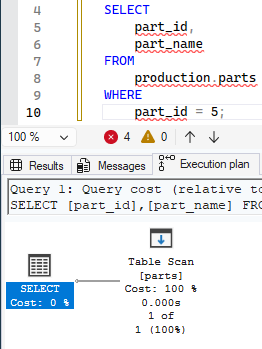
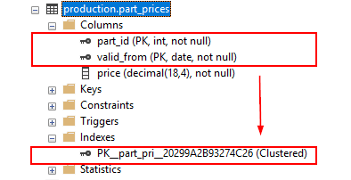
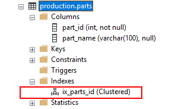
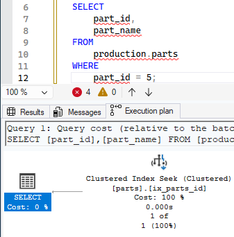
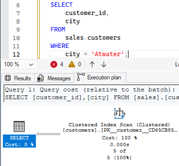
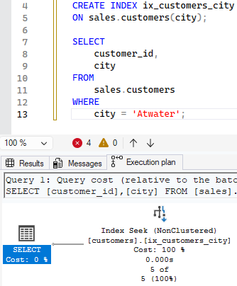

# Plusz infók

## _'szoveg'_ és _like szoveg_ közti különbség 
- LIKE does wildcard matching.
- LIKE also has an ESCAPE clause so you can set an escape character.
- ```sql
    use AdventureWorks2025

    select FirstName as '=' from Person.Person where FirstName = 'G%'
    go
    select FirstName as 'like' from Person.Person where FirstName like 'G%'
    ```
    - 
- ```sql
    use AdventureWorks2025

    select FirstName as '=' from Person.Person where FirstName = 'Gabriel'
    go
    select FirstName as 'like' from Person.Person where FirstName like 'Gabriel'
    ```
- A LIKE lassabb
- 
- https://stackoverflow.com/questions/6142235/sql-like-vs-performance/28609481#28609481
- ```sql
    -- Source - https://stackoverflow.com/a/6143002
    -- Posted by JNK, modified by community. See post 'Timeline' for change history
    -- Retrieved 2026-03-02, License - CC BY-SA 3.0

    Create Table #TempTester (id int, col1 varchar(20), value varchar(20))
    go

    INSERT INTO #TempTester (id, col1, value)
    VALUES
    (1, 'this is #1', 'abcdefghij')
    GO

    INSERT INTO #TempTester (id, col1, value)
    VALUES
    (2, 'this is #2', 'foob'),
    (3, 'this is #3', 'abdefghic'),
    (4, 'this is #4', 'other'),
    (5, 'this is #5', 'zyx'),
    (6, 'this is #6', 'zyx'),
    (7, 'this is #7', 'zyx'),
    (8, 'this is #8', 'klm'),
    (9, 'this is #9', 'klm'),
    (10, 'this is #10', 'zyx')
    GO 10000

    CREATE CLUSTERED INDEX ixId ON #TempTester(id)CREATE CLUSTERED INDEX ixId ON #TempTester(id)

    CREATE NONCLUSTERED INDEX ixTesting ON #TempTester(value)
    ```
- ```sql
    -- Source - https://stackoverflow.com/a/6143002
    -- Posted by JNK, modified by community. See post 'Timeline' for change history
    -- Retrieved 2026-03-02, License - CC BY-SA 3.0

    SELECT * FROM #TempTester WHERE value LIKE 'abc%'

    SELECT * FROM #TempTester WHERE value = 'abcdefghij'
    ```
- 
## AND OR AND OR példa 
- ```sql
    use SampleDatabase

    select * from sales.staffs
    where first_name = 'Kali' and first_name = 'Ventia' or first_name = 'Layla' and first_name = 'Genna' or first_name = 'Fabiola'
    ```
- 

## NULL helyettesítése
- ```sql
    use AdventureWorks2025

    SELECT ProductName, UnitPrice * (UnitsInStock + ISNULL(UnitsOnOrder, 0))
    FROM Products;

    go

    SELECT ProductName, UnitPrice * (UnitsInStock + COALESCE(UnitsOnOrder, 0))
    FROM Products;
    ```
- ISNULL: Return the specified value IF the expression is NULL, otherwise return the expression:
- COALESCE: Return the first non-null value in a list:
## Full text search és sima stringes
- Miért ilyen körülményes 😭
- https://stackoverflow.com/questions/6003240/cannot-use-a-contains-or-freetext-predicate-on-table-or-indexed-view-because-it
- ```sql
    use AdventureWorks2025

    select* 
    from Production.ProductDescription
    where CONTAINS((Description), '"bike" or "High-performance"')

    go

    select * 
    from Production.ProductDescription
    where Description like '%bike%' or Description like '%High-performance%'

    go 

    select * 
    from Production.ProductDescription
    where 'bike' in (
        select value
        from STRING_SPLIT(Production.ProductDescription.Description, ' '))
        or 'High-performance' in (
        select value
        from STRING_SPLIT(Production.ProductDescription.Description, ' '))
    ```
    - 3 különböző eredmény:(
    - miért?
- 

## BETWEEN és logikai operátotok közül melyik gyorsabb + példa
- ```sql
    use AdventureWorks2025

    select UnitPrice
    from Sales.SalesOrderDetail
    where UnitPrice between 200 and 2000

    go

    select UnitPrice
    from Sales.SalesOrderDetail
    where UnitPrice > 200 and UnitPrice < 2000
    ```
- 

## 10k elemet taralmaz az in listában fölsorolva
- ```sql
    use AdventureWorks2025

    SELECT SalesOrderDetailID
    from Sales.SalesOrderDetail
    where UnitPrice in (
        select top (10000) UnitPrice
        from Sales.SalesOrderDetail)
    ```

## ORDER BY limitációi
- ORDER BY with large datasets can be expensive
    - Sorting requires memory and may spill to disk if the dataset is large or not indexed appropriately.
    - ```sql
        use AdventureWorks2025

        SELECT SalesOrderDetailID
        from Sales.SalesOrderDetail
        order by UnitPrice
        ```
        - ~ 121k sor - indexelt, simán megy
    - Sorting unindexed columns forces a full sort operation.
        - ```sql
            Create Table #TempTester (id int, col1 varchar(20), value varchar(20))
            go

            INSERT INTO #TempTester (id, col1, value)
            VALUES
            (1, 'this is #1', 'abcdefghij')
            GO

            INSERT INTO #TempTester (id, col1, value)
            VALUES
            (2, 'this is #2', 'foob'),
            (3, 'this is #3', 'abdefghic'),
            (4, 'this is #4', 'other'),
            (5, 'this is #5', 'zyx'),
            (6, 'this is #6', 'zyx'),
            (7, 'this is #7', 'zyx'),
            (8, 'this is #8', 'klm'),
            (9, 'this is #9', 'klm'),
            (10, 'this is #10', 'zyx')
            GO 1000000
            ```
        - ```sql
            SELECT * FROM #TempTester ORDER BY id
            ```
        - 
            - 9M sorra
- ORDER BY with OFFSET/FETCH requires deterministic ordering
    - If the ORDER BY expression is not unique, pagination may return inconsistent results between executions.
    - Example: ordering only by a non-unique column (e.g., ORDER BY LastName) can cause row shuffling.
    - ```sql
        use AdventureWorks2025

        select FirstName, LastName
        from Person.Person
        order by FirstName
        offset 1000 row fetch first 2000 row only
        ```
- ORDER BY with DISTINCT, UNION, or GROUP BY has restrictions
ORDER BY can only reference output columns or their ordinal positions.
    - You cannot order by a column not present in the SELECT list when using DISTINCT or UNION.
    - ```sql
        use AdventureWorks2025

        select distinct FirstName
        from Person.Person
        order by LastName
        ```
- ORDER BY with text/image/ntext types is not allowed
Legacy LOB types cannot be sorted directly. They must be cast to varchar(max) or similar.

## Több szerint csoportosítás
- ```sql
    use AdventureWorks2025

    select LastName, FirstName
    from Person.Person
    order by LastName, FirstName
    ```

## COUNT(*) és COUNT(oszlop) (teljesítmény)
|COUNT oszlop|COUNT *|
|-|-|
|||
- hmmmm

## SELECT * és SELECT oszlopok teljesítmény
|SELECT oszlopok|SELECT *|
|-|-|
|||
- és tényleg van különbség

## JOIN-nal ON után és a WHERE-ben adunk feltételt mi lesz a teljesítményben a különbség
|WHERE|SELECT *|
|-|-|
|||
- WHERE valamennyivel olcsóbb

## JOIN-nal 4-5 tábla
- ```sql
    use AdventureWorks2025

    select 
    Title + ' ' + FirstName + ' ' + LastName as FullName, 
        PhoneNumber,
        EmailAddress,
        CardNumber
    from Person.Person as person
        left join Person.PersonPhone as phone	-- csak akiknek van telefonszama
            on person.BusinessEntityID = phone.BusinessEntityID
        left join Sales.PersonCreditCard as pcard	-- csak akinek van szamlaszama
            on person.BusinessEntityID = pcard.BusinessEntityID
        join Sales.CreditCard as ccard
            on pcard.CreditCardID = ccard.CreditCardID
        left join Person.EmailAddress as email -- csak akinek van emailje
            on person.BusinessEntityID = email.BusinessEntityID
    where Title = 'Ms.'
        and phone.PhoneNumber is not null	-- csak akiknek van telefonszama
        and pcard.CreditCardID is not null	-- csak akinek van szamlaszama
        and email.EmailAddress is not null	-- csak akinek van emailje
    ```
    - Remélem jól használtam a joinokat
    - Tökéletes scammer lekérdezés

## AVG, SUM ha van NULL mit csinál
- https://learn.microsoft.com/en-us/sql/t-sql/functions/avg-transact-sql?view=sql-server-ver17
- It ignores null values.
- The only aggregate function that doesn't ignore NULL values is COUNT(*). Even COUNT() ignores NULL values, if a column name is given.
- ```sql
    use SampleDatabase

    select AVG(number) as avg,
        SUM(number) as sum,
        MIN(number) as min,
        MAX(number) as max
    from temp.temp
    ```
## CAST mit csinál, ha nem sikerül (null-t int-re stb)
- A null-t nem bántja, atöbbit a táblázat szerint
- 
- https://learn.microsoft.com/en-us/sql/t-sql/functions/cast-and-convert-transact-sql?view=sql-server-ver17
- ha nem sikerül hibát dob
- ```sql
    use SampleDatabase

    select CAST(number as int) as int, CAST(string as int), string
    from temp.temp
    ```
## Gouping csoportositas (727. sor alisas-ok)
- ```sql
    use AdventureWorks2025

    select Production.ProductCategory.ProductCategoryID,
        grouping(Production.ProductCategory.ProductCategoryID),
        Production.Product.ProductSubcategoryID,
        grouping(Production.Product.ProductSubcategoryID),
        AVG(ListPrice) as 'Average',
        MIN(ListPrice) as 'Minimum',
        MAX(ListPrice) as 'Maximum'
    from Production.Product
    join Production.ProductSubcategory
    on Production.ProductSubcategory.ProductSubcategoryID = 
        Production.Product.ProductSubcategoryID
    join Production.ProductCategory
    on Production.ProductSubcategory.ProductCategoryID = 
        Production.ProductCategory.ProductCategoryID
    where ListPrice <> 0
    group by Production.ProductCategory.ProductCategoryID, Product.ProductSubcategoryID
    with rollup
    ```
    - Kiszámolja az átlag, min, max árakat az összes alkategóriára a kategóriákon belül
    - 

## except where feltetellel (melyik a jobb teljeitmenyben)
- 

## APPLY és JOIN-ok közti külonbség (melyik a jobb)
- Az appy akkor hasznos, ha van table-valued function, egyéként kicsi különbség van teljesítményben köztük
- Ha van egyszerű join-os megoldása a feladatnak, akkor inkább azt érdemes használni (az apply nehezen értelmezhető?)
- Az egymásba ágyazott REPLACE-ket lehet kicsit szebben ,egcsinálni vele (lsd később)
- https://www.mssqltips.com/sqlservertip/1958/sql-server-cross-apply-and-outer-apply/

    |Operator|Similar|
    |-|-|
    |CROSS APPLY|INNER JOIN|
    |OUTER APPLY|LEFT JOIN|

## Dátum formátumok egymás közötti átalakítása
- https://www.mssqltips.com/sqlservertip/1145/date-and-time-conversions-using-sql-server/
- akármilyen formában illeszted be ha dátum orm megoldja
- ```sql
    use SampleDatabase

    insert into temp.temp (time)
    values (CONVERT(varchar,GETDATE(), 102))
    ```
    - érdemes kipróbálni 104, 105-tel

## Különböző időzónák kötzi konvertálás
- datetimeoffset adattípussal lehet tárolni különböző időzónákat
- ```sql
    use SampleDatabase

    select * from temp.temp
    ```
- ```sql
    use SampleDatabase

    select 
        time_zone AT TIME ZONE 'UTC' AT TIME ZONE 'Central European Standard Time' 
        from temp.temp
        where time_zone is not null

    go

    SELECT time_zone AT TIME ZONE 'India Standard Time' AT TIME ZONE 'UTC'
    from temp.temp
    where time_zone is not null
    ```

## Pattern kicserélése (London és Uk ugyan az és ezt replacelni)
- ```sql
    use SampleDatabase

    select REPLACE(production.products.product_name, 'Trek', 'BOMBACLAT')
    from production.products

    go

    select REPLACE(REPLACE(production.products.product_name, 'Trek', 'BOMBACLAT'), '2016', 'Kettoezertizenhat')
    from production.products

    go

    select pp2.product_name
    from production.products as pp
        CROSS APPLY (select REPLACE(pp.product_name, 'Trek', 'BOMBACLAT') as product_name) as pp1 
        CROSS APPLY (select REPLACE(pp1.product_name, '2016', 'Kettoezertizenhat') as product_name) as pp2;
    ```

## datalenght a tenylegesen hasznaltat irja e ki
- Igen
- 
    - varchar(255) a típusa alapból

## Beszúrás allekérdezéssel kell-e VALUES 
- Nem

## INSERT INTO, SELECT INTO kulonbseg
- INSERT INTO SELECT inserts into an existing table.
- SELECT INTO creates a new table and puts the data in it.
    - All of the columns in the query must be named so each of the columns in the table will have a name.
    - The data type and nullability come from the source query.
    - If one of the source columns is an identity column and meets certain conditions (no JOINs in the query for example) then the column in the new table will also be an identity.
- ```sql
    CREATE TABLE MyTable (name varchar(255));
    GO
    INSERT INTO MyTable
    SELECT name
    FROM sys.databases;
    GO

    SELECT name INTO ujtabla
    FROM sys.databases;
    GO
    ```
    - #ujtabla inkább

## # és ## példa, temp-et törölni kell-e, mikor tölödik
- Érdemes törölni, hogy ne foglaljanak helyet
- Temporary tables are only visible to the session in which they were created and are automatically dropped when that session closes (bezárod a querryt).
- Local Temporary Tables: 
    - Used to store temporary data for the current session only.
        - When you're breaking down a large query into smaller, manageable parts.
        - Store intermediate results while performing calculations.
        - Temporary data can be useful for testing or debugging stored procedures.
- Use Global Temporary Tables
    - Used to store temporary data that can be shared across multiple sessions.
        - If you need to share temporary results between multiple sessions.
        - When multiple users need access to the same intermediate data.
- ```sql
    use AdventureWorks2025

    go
    --create table #names (BId int, FirstName nvarchar(50));
    go
    select BusinessEntityID, FirstName into #names from Person.Person
    --insert into #names (BId, FirstName) values (1, 'Asd'), (2, 'DSa')
    go
    select * from #names
    go
    drop table #names
    ```

## Hogyan lehet ténylegesen felszabadítani a helyet (truncate delete)
- Shrink a database
    - Shrinking data files recovers space by moving pages of data from the end of the file to unoccupied space closer to the front of the file. When enough free space is created at the end of the file, data pages at end of the file can be deallocated and returned to the file system.
- ```sql
    DBCC SHRINKDATABASE (UserDB, 10);
    GO
    ```
    - Decrease the size of the data and log files in the UserDB database, and to allow for 10 percent free space in the database.

## Melyik tábalában hány sor van és mennyi helyet foglal
- ```sql
    use AdventureWorks2025

    select SUM(DATALENGTH(FirstName)) as meret,
    COUNT(FirstName) as sor
    from Person.Person
    ```
- ```sql
    use AdventureWorks2025
    go
    sp_spaceused '[HumanResources].[Employee]'
    go
    exec sp_MSForEachTable 'exec sp_spaceused [?]';
    ```

## INSERT-né az utolsó sornak mi az indexe
- ```sql
    use AdventureWorks2025

    create table #temp (
    id int identity,
    num int)

    insert into #temp (num) output inserted.id values (123), (234), (345)

    select * from #temp

    SELECT SCOPE_IDENTITY();

    SELECT TOP 1 id FROM #temp ORDER BY id DESC;
    ```

## Tranzakciós izolációs szinteket hogy lehet létrehozni, tábla sor szintű lockolások, előnyök hátrányok
- Transaction isolation levels are how SQL databases solve data reading problems in concurrent transactions. That is, when one transaction reads the same data that another transaction is simultaneously changing.
- ```sql
    SET TRANSACTION ISOLATION LEVEL
        { READ UNCOMMITTED
        | READ COMMITTED
        | REPEATABLE READ
        | SNAPSHOT
        | SERIALIZABLE
        }
    ```
- Dirty read: read uncommitted modifications
- READ UNCOMMITTED
    - Specifies that **statements can read rows that were modified by other transactions but not yet committed**.
    - **Transactions** running at the READ UNCOMMITTED level **don't issue shared locks to prevent other transactions from modifying data read by the current transaction**. READ UNCOMMITTED transactions are **also not blocked by exclusive locks** that would prevent the current transaction from reading rows that were modified but not committed by other transactions. 
    - **Least restrictive** of the isolation levels. **Dirty reads are posseble**.
- READ COMMITTED
    - **Statements can't read data that was modified but not committed by other transactions.**
    - **Data can be changed by other transactions between individual statements within the current transaction**, resulting in nonrepeatable reads or phantom data.
- REPEATABLE READ
    - **Statements can't read data that was modified but not yet committed by other transactions**, and that **no other transactions can modify data that was read by the current transaction until the current transaction completes**.
    - **Shared locks are placed on all data read by each statement in the transaction and are held until the transaction completes.** This prevents other transactions from modifying any rows that were read by the current transaction. **Other transactions can insert new rows that match the search conditions of statements issued by the current transaction.** If the current transaction then retries the statement, it retrieves the new rows, which results in **phantom reads**. Because shared locks are held to the end of a transaction instead of being released at the end of each statement.
- SNAPSHOT
    - **Data read by any statement in a transaction is the transactionally consistent version of the data that existed at the start of the transaction**. The transaction can only recognize data modifications that were **committed before** the start of the transaction. Data modifications made by other transactions after the start of the current transaction aren't visible to statements executing in the current transaction.
    - **SNAPSHOT transactions don't request locks when reading data. SNAPSHOT transactions reading data don't block other transactions from writing data. Transactions writing data don't block SNAPSHOT transactions from reading data**.
- SERIALIZABLE
    - Specifies the following conditions:
        - **Statements can't read data that was modified but not yet committed by other transactions.**
        - **No other transactions can modify data that was read by the current transaction until the current transaction completes.**
        - **Other transactions can't insert new rows with key values that would fall in the range of keys read by any statements in the current transaction until the current transaction completes.**
    - **Range locks are placed in the range of key values that match the search conditions of each statement executed in a transaction**. This **blocks other transactions from updating or inserting any rows that would qualify for any of the statements executed by the current transaction**. The range locks are held until the transaction completes. This is the most restrictive of the isolation levels.
- 
- row → page → table → database
    1. Row Locks
        - Applied to individual rows.
        - Allow high concurrency.
    2. Key Locks
        - Used on index entries.
        - Protects index ranges during operations like SELECT ... WHERE.
    3. Page Locks
        - Lock an 8 KB page containing multiple rows.
        - Used when many rows on the same page are affected.
    4. Table Locks
        - Lock the entire table.
        - A query affects a large portion of the table.


# Előre
## Views bővebben
### Általánosságban
https://www.sqlservertutorial.net/sql-server-views/ <br>
A view is a named query stored in the database catalog that allows you to refer to it later.

---
van ez a lekérdezés:
```sql
    SELECT
        product_name, 
        brand_name, 
        list_price
    FROM
        production.products p
    INNER JOIN production.brands b 
            ON b.brand_id = p.brand_id;
```
ezt el lehet menteni egy view-ként 
```sql
CREATE VIEW sales.product_info
AS
SELECT
    product_name, 
    brand_name, 
    list_price
FROM
    production.products p
INNER JOIN production.brands b 
        ON b.brand_id = p.brand_id;
```
és később ebből tudunk lekérdezni
```sql
SELECT * FROM sales.product_info;
```
igazából a háttérben a lekérdezésből kérdezünk le
```sql
SELECT 
    *
FROM (
    SELECT
        product_name, 
        brand_name, 
        list_price
    FROM
        production.products p
    INNER JOIN production.brands b 
        ON b.brand_id = p.brand_id;
);
```
---
By definition, views do not store data except for indexed views.
Egy view több tábla összekapcsolásából is állhat vagy egy táblának pár sorából, el lehet rejteni a komplex lekérdezéseket. <br>


Előnyök:
- Security: You can restrict users to access directly to a table and allow them to access a subset of data via views.
- Simplicity: You can simplify the complex queries with joins and conditions using a set of views.
- Consistency: Sometimes, you need to write a complex formula or logic in every query. Once views are defined, you can reference the logic from the views rather than rewriting it in separate queries.

### CREATE VIEW
```sql
CREATE VIEW [OR ALTER] schema_name.view_name [(column_list)]
AS
    select_statement;
```
- If you don’t explicitly specify a list of columns for the view, SQL Server will use the column list derived from the SELECT statement.
```sql
CREATE VIEW sales.daily_sales
AS
SELECT
    year(order_date) AS y,
    month(order_date) AS m,
    day(order_date) AS d,
    p.product_id,
    product_name,
    quantity * i.list_price AS sales
FROM
    sales.orders AS o
INNER JOIN sales.order_items AS i
    ON o.order_id = i.order_id
INNER JOIN production.products AS p
    ON p.product_id = i.product_id;

go

SELECT 
    * 
FROM 
    sales.daily_sales
ORDER BY
    y, m, d, product_name;

go

CREATE OR ALTER sales.daily_sales (
    year,
    month,
    day,
    customer_name,
    product_id,
    product_name
    sales
)
AS
SELECT
    year(order_date),
    month(order_date),
    day(order_date),
    concat(
        first_name,
        ' ',
        last_name
    ),
    p.product_id,
    product_name,
    quantity * i.list_price
FROM
    sales.orders AS o
    INNER JOIN
        sales.order_items AS i
    ON o.order_id = i.order_id
    INNER JOIN
        production.products AS p
    ON p.product_id = i.product_id
    INNER JOIN sales.customers AS c
    ON c.customer_id = o.customer_id;

```
Lehet aggregate function-t is hasznáni (SUM, AVG, stb)

### DROP VIEW
```sql
DROP VIEW [IF EXISTS] 
    schema_name.view_name1, 
    schema_name.view_name2,
    ...;
```

### Rename VIEW
 <br>
Vagy használjuk a stored procedure-t.
```sql
EXEC sp_rename 
    @objname = 'sales.product_catalog',
    @newname = 'product_list';
```
   - @objname: name of the view which you want to rename
   - @newname: new view name

### List VIEW-s
To list all views in a SQL Server Database, you query the sys.views or sys.objects catalog view.
```sql
SELECT 
	OBJECT_SCHEMA_NAME(v.object_id) schema_name,
	v.name
FROM 
	sys.views as v;
```

### Getting information about a VIEW
Using the system catalog sys.sql_module and the OBJECT_ID() function:
- ```sql
    SELECT
        definition,
        uses_ansi_nulls,
        uses_quoted_identifier,
        is_schema_bound
    FROM
        sys.sql_modules
    WHERE
        object_id
        = object_id(
                'sales.daily_sales'
            );
    ```
Using the sp_helptext stored procedure:
- ```sql
    EXEC sp_helptext 'sales.daily_sales' ;
    ```
Using OBJECT_DEFINITION() function:
- ```sql
    SELECT 
        OBJECT_DEFINITION(
            OBJECT_ID(
                'sales.daily_sales'
            )
        ) view_info;
    ```

### Indexed VIEW
Indexed views are materialized views that stores data physically like a table hence may provide some the performance benefit if they are used appropriately.

How to create an indexed view:
1. Create a view that uses the WITH SCHEMABINDING option which binds the view to the schema of the underlying tables.
2. create a unique clustered index on the view. This materializes the view.

Because of the WITH SCHEMABINDING option, if you want to change the structure of the underlying tables which affect the indexed view’s definition, you must drop the indexed view first before applying the changes.<br>
Amikor a táblákba van adatmódosítás, akkor az indexed viewban is módosítani kell, emiatt több erőforrást jelentenek ezek a múveletek. Emiatt olyan táblákhoz érdemes indexed view-okat készíteni, amikben ritkán van adatmódosítás.

---
Készítünk egy VIEW-t a SCHEMABINDING opcióval
```sql
CREATE VIEW production.product_master
WITH SCHEMABINDING
AS 
SELECT
    product_id,
    product_name,
    model_year,
    list_price,
    brand_name,
    category_name
FROM
    production.products p
INNER JOIN production.brands b 
    ON b.brand_id = p.brand_id
INNER JOIN production.categories c 
    ON c.category_id = p.category_id;
```
Megnézzük mennyi a költsége eredetileg a lekérdezésnek. Ezután létrehozunk két indexet és megnézzük újra a lekérdezés költségét.
```sql
SELECT 
    * 
FROM
    production.product_master
ORDER BY
    product_name;

GO

CREATE UNIQUE CLUSTERED INDEX 
    ucidx_product_id 
ON production.product_master(product_id);

GO

CREATE NONCLUSTERED INDEX 
    ucidx_product_name
ON production.product_master(product_name);

GO

SELECT 
    * 
FROM
    production.product_master
ORDER BY
    product_name;
```
<br>
Az indexek létrehozása után nagyobb lesz a költség.

## Indexek bővebben
### Clustered indexes
The production.parts table does not have a primary key. Therefore SQL Server stores its rows in an unordered structure called a heap.<br>
When you query data from the production.parts table, the query optimizer needs to scan the whole table to search.
<br>
Ez sok idő ha sok sor van a táblában, ezért vannak az indexek, amik felgyorsítják a folyamatot.

Clustered index:
- Stores data rows in a sorted structure based on its key values.
- Each table has only one clustered index because data rows can be only sorted in one order.
- A table that has a clustered index is called a clustered table.
- B-ákat használ (alga2 :) ) -> logaritmikus időben keresés, beszúrás, fissítás, tölés

When you create a table with a primary key, SQL Server automatically creates a corresponding clustered index that includes primary key columns.
```sql
CREATE TABLE production.part_prices(
    part_id int,
    valid_from date,
    price decimal(18,4) not null,
    PRIMARY KEY(part_id, valid_from) 
);
```
<br>
If you add a primary key constraint to an existing table that already has a clustered index, SQL Server will enforce the primary key using a non-clustered index:

### CREATE CLUSTERED INDEX
```sql
CREATE CLUSTERED INDEX index_name
ON schema_name.table_name (column_list);  
```
When a table does not have a primary key, you can use the CREATE CLUSTERED INDEX statement to add a clustered index to it.
```sql
CREATE CLUSTERED INDEX ix_parts_id
ON production.parts (part_id);  
```
<br>
<br>
When executing the following statement, the SQL Server traverses the index (Clustered Index Seek) to locate the rows, which is faster than scanning the whole table.

### CREATE INDEX
Non-clustered indexes:
- Sorts and stores data separately from the data rows in the table. It is a copy of selected columns of data from a table with the links to the associated table.
- Uses the B-tree structure to organize its data.
- A table may have one or more nonclustered indexes and each non-clustered index may include one or more columns in a table.
```sql
CREATE [NONCLUSTERED] INDEX index_name
ON table_name(column_list);
```




